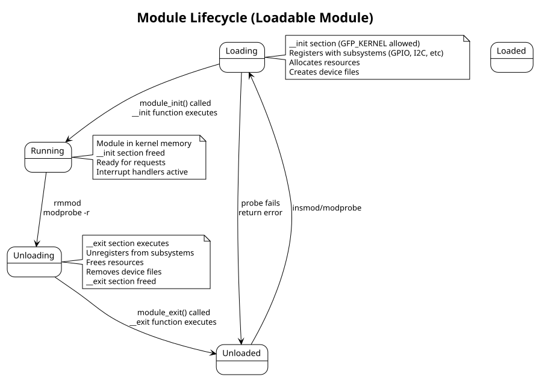

:PROPERTIES:
:ID:       f1a2b3c4-d5e6-47f8-99a1-b2c3d4e5f6a7
:END:
#+title: Kernel Module Fundamentals
#+author: Arun Jyothish K
#+filetags: :kernel:modules:fundamentals:

*Essential patterns and attributes for kernel modules and built-in drivers.*

** Module Entry/Exit

=__init= and =__exit= are optional but recommended:
- =__init= :: function runs at module load or kernel boot; kernel can discard memory after init
- =__exit= :: function runs at module unload; ignored if driver is built-in (can't be unloaded)

=module_init()= and =module_exit()= macros register the entry/exit functions:

#+begin_src c
// Basic module structure
#include <linux/module.h>
#include <linux/init.h>

static int __init my_driver_init(void)
{
    pr_info("my_driver: loaded\n");
    return 0;
}

static void __exit my_driver_exit(void)
{
    pr_info("my_driver: unloaded\n");
}

module_init(my_driver_init);
module_exit(my_driver_exit);

MODULE_LICENSE("GPL");
MODULE_AUTHOR("Your Name");
MODULE_DESCRIPTION("Minimal driver module");
MODULE_VERSION("1.0");
#+end_src

** License & Metadata

Always include =MODULE_LICENSE("GPL")= or appropriate license. Unlicensed modules may taint the kernel (affects oops reports, debugging, support).

** Built-in vs Loadable

| Aspect | Loadable | Built-in |
|--------|----------|----------|
| =__init= memory | freed after init | freed after boot |
| =__exit= code | preserved; runs on rmmod | discarded; unused |
| Load | insmod/modprobe | automatic at boot |
| Symbol visibility | module namespace | kernel namespace |
| Dependencies | can be independent | tied to kernel version |

** Return Value Semantics

- =module_init()= returns 0 on success, non-zero on failure (insmod returns error)
- =module_exit()= returns void (no failure path for unload)

For probe functions in device drivers, return 0 for success, negative errno (e.g., =-ENOMEM=, =-ENODEV=) on failure.

** Module Lifecycle Diagram

#+begin_src plantuml :file res/01-module-lifecycle.svg
!theme plain
title Module Lifecycle (Loadable Module)

state "Unloaded" as unloaded
state "Loading" as loading
state "Loaded" as loaded
state "Running" as running
state "Unloading" as unloading

unloaded --> loading: insmod/modprobe

loading --> running: module_init() called\n__init function executes
loading --> unloaded: probe fails\nreturn error

running --> unloading: rmmod\nmodprobe -r

unloading --> unloaded: module_exit() called\n__exit function executes

note right of loading
  __init section (GFP_KERNEL allowed)
  Registers with subsystems (GPIO, I2C, etc)
  Allocates resources
  Creates device files
end note

note right of running
  Module in kernel memory
  __init section freed
  Ready for requests
  Interrupt handlers active
end note

note right of unloading
  __exit section executes
  Unregisters from subsystems
  Frees resources
  Removes device files
  __exit section freed
end note
#+end_src

#+RESULTS:

** See Also
- [[id:c1d2e3f4-g5h6-4789-99a1-b2c3d4e5f6a7][Kernel Build System (Kbuild)]]
- [[id:a1b2c3d4-e5f6-4789-99a1-b2c3d4e5f6a7][Device Tree (DTS) & Bindings]]
