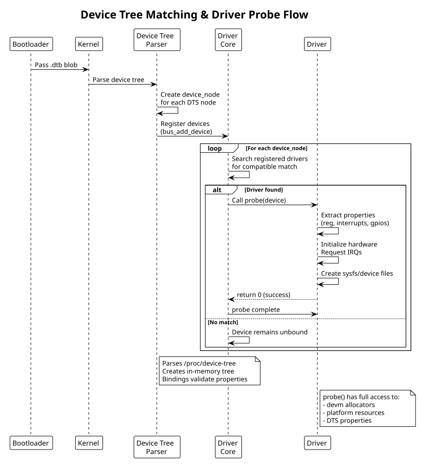

:PROPERTIES:
:ID:       a1b2c3d4-e5f6-4789-99a1-b2c3d4e5f6a7
:END:
#+title: Device Tree (DTS) & Bindings
#+author: Arun Jyothish K
#+filetags: :devicetree:dts:bindings:hardware:

*Device tree source (DTS) format, bindings documentation, and integration with driver probe.*

** DTS Structure

Device tree describes hardware in declarative form. Bootloader passes compiled .dtb (device tree blob) to kernel.

#+begin_src dts
// arch/arm/boot/dts/my-soc.dts
/dts-v1/;

/ {
  compatible = "vendor,soc-name";

  // Board/SOC-level node
  soc {
    compatible = "simple-bus";

    // Peripheral node
    gpio@1000 {
      compatible = "vendor,gpio-controller";
      reg = <0x1000 0x100>;        // base address, size
      #gpio-cells = <2>;           // gpio phandle format
      interrupt-controller;
      #interrupt-cells = <2>;
      interrupts = <42 0>;         // IRQ number, flags
    };

    // Platform device with phandle reference
    led-controller@2000 {
      compatible = "vendor,led-controller";
      reg = <0x2000 0x50>;
      gpios = <&gpio 10 0>,        // phandle reference
              <&gpio 11 0>;
    };
  };

  // Top-level chosen/cpus nodes omitted for brevity
};
#+end_src

** Common Properties

| Property | Type | Purpose |
|----------|------|---------|
| =compatible= | string-list | Driver matching; first value must match driver's compatible string |
| =reg= | address/size cells | Memory-mapped registers |
| =interrupts= | interrupt specifier | IRQ assignment |
| =gpios= | phandle + specifier | GPIO references |
| =status= | string | "okay" (enabled), "disabled", "reserved" |
| =label= | string | Human-readable identifier |

** Device Tree Bindings Documentation

Bindings define the contract between device tree and driver. Bindings live in kernel source:
- `Documentation/devicetree/bindings/` — per-subsystem binding specs
- Specifies: compatible strings, required/optional properties, interrupts, clocks, regulators, etc.

Example binding: `Documentation/devicetree/bindings/gpio/vendor,gpio-controller.txt`

#+begin_src
GPIO Controller Binding

Required properties:
- compatible: "vendor,gpio-controller"
- reg: base address and size
- #gpio-cells: must be 2
- interrupt-controller: present if supports interrupts
- #interrupt-cells: 2 (gpio index, flags)

Optional properties:
- gpio-controller: presence marks as GPIO provider
- label: human name

Example:
  gpio@1000 {
    compatible = "vendor,gpio-controller";
    reg = <0x1000 0x100>;
    #gpio-cells = <2>;
    interrupt-controller;
    #interrupt-cells = <2>;
  };
#+end_src

** Driver Integration: Platform Device

Platform drivers probe via device tree match:

#+begin_src c
static const struct of_device_id my_gpio_dt_match[] = {
    { .compatible = "vendor,gpio-controller", .data = (void *)1 },
    { /* terminator */ },
};
MODULE_DEVICE_TABLE(of, my_gpio_dt_match);

static struct platform_driver my_gpio_driver = {
    .driver = {
        .name = "vendor-gpio",
        .of_match_table = my_gpio_dt_match,
    },
    .probe = my_gpio_probe,
    .remove = my_gpio_remove,
};

static int my_gpio_probe(struct platform_device *pdev)
{
    struct device_node *np = pdev->dev.of_node;
    struct resource *res;

    // Extract reg property
    res = platform_get_resource(pdev, IORESOURCE_MEM, 0);
    void __iomem *base = devm_ioremap_resource(&pdev->dev, res);

    // Extract GPIO properties
    int ngpios = of_gpio_count(np);

    // Extract interrupts
    int irq = platform_get_irq(pdev, 0);

    // Rest of probe logic...
    return 0;
}

module_platform_driver(my_gpio_driver);
#+end_src

** DTS Properties in Code

Common =of_*= functions to read DTS properties:

#+begin_src c
// Read string
const char *name;
of_property_read_string(np, "label", &name);

// Read u32 integer
u32 val;
of_property_read_u32(np, "reg", &val);

// Count cells
int count = of_gpio_count(np);

// Get phandle reference
struct device_node *ref = of_parse_phandle(np, "gpios", 0);

// Check property presence
bool has_interrupts = of_find_property(np, "interrupt-controller", NULL);

// Iterate children
struct device_node *child;
for_each_child_of_node(np, child) {
    // process child nodes
}
#+end_src

** DTS Compilation

Bootloader/build system compiles .dts → .dtb:

#+begin_src bash
# Compile device tree
dtc -O dtb -o arch/arm/boot/dts/my-soc.dtb arch/arm/boot/dts/my-soc.dts

# Decompile for inspection
dtc -O dts -o my-soc-out.dts arch/arm/boot/dts/my-soc.dtb
#+end_src

** Probe Flow

1. Bootloader loads .dtb, passes to kernel
2. Device tree parser creates device nodes
3. Kernel matches device nodes against registered drivers (via =compatible= string)
4. Driver's =probe()= called for each matching device
5. Driver reads DTS properties, initializes hardware, creates sysfs/device files

** Device Tree Matching Flow

#+begin_src plantuml :file res/02-dts-matching-flow.svg
!theme plain
title Device Tree Matching & Driver Probe Flow

participant Bootloader
participant Kernel
participant DTParser as "Device Tree\nParser"
participant DriverCore as "Driver\nCore"
participant Driver

Bootloader -> Kernel: Pass .dtb blob
Kernel -> DTParser: Parse device tree
DTParser -> DTParser: Create device_node\nfor each DTS node
DTParser -> DriverCore: Register devices\n(bus_add_device)

loop For each device_node
  DriverCore -> DriverCore: Search registered drivers\nfor compatible match

  alt Driver found
    DriverCore -> Driver: Call probe(device)
    Driver -> Driver: Extract properties\n(reg, interrupts, gpios)
    Driver -> Driver: Initialize hardware\nRequest IRQs
    Driver -> Driver: Create sysfs/device files
    Driver --> DriverCore: return 0 (success)
    DriverCore -> Driver: probe complete
  else No match
    DriverCore -> DriverCore: Device remains unbound
  end
end

note right of DTParser
  Parses /proc/device-tree
  Creates in-memory tree
  Bindings validate properties
end note

note right of Driver
  probe() has full access to:
  - devm allocators
  - platform resources
  - DTS properties
end note
#+end_src

** See Also
- [[id:f1a2b3c4-d5e6-47f8-99a1-b2c3d4e5f6a7][Kernel Module Fundamentals]]
- [[id:g1h2i3j4-k5l6-4789-99a1-b2c3d4e5f6a7][Platform Drivers]] — full platform driver example
- [[id:41bfcbfa-8054-4ff6-86e9-fc663348d7ed][I2C & SPI Subsystem Drivers]] — =reg=/=interrupts= binding usage on bus-attached devices
- [[id:k1l2m3n4-o5p6-4789-99a1-b2c3d4e5f6a7][Linux Boot Sequence]] — device tree loading and probe during boot
