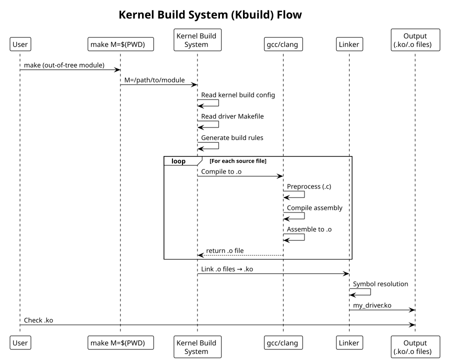

:PROPERTIES:
:ID:       c1d2e3f4-g5h6-4789-99a1-b2c3d4e5f6a7
:END:
#+title: Kernel Build System (Kbuild)
#+author: Arun Jyothish K
#+filetags: :kbuild:build:makefile:

*Kernel build system for drivers: compilation, linking, module objects.*

** Out-of-Tree Module Makefile

Standard pattern for standalone modules:

#+begin_src makefile
# Makefile for out-of-tree module

obj-m += my_driver.o

# Multi-file module (if needed)
# my_driver-objs := main.o utils.o

all:
	make -C /lib/modules/$(shell uname -r)/build M=$(PWD) modules

clean:
	make -C /lib/modules/$(shell uname -r)/build M=$(PWD) clean

install:
	make -C /lib/modules/$(shell uname -r)/build M=$(PWD) modules_install

help:
	make -C /lib/modules/$(shell uname -r)/build M=$(PWD) help
#+end_src

Key variables:
- =obj-m= :: compile as loadable module
- =obj-y= :: compile into kernel (for in-tree drivers)
- =M=$(PWD)= :: build directory (tells kbuild to build out-of-tree module)
- =/lib/modules/$(uname -r)/build= :: kernel source symlink

** KERNEL_SRC Alternative

For non-standard kernel paths (cross-compile, custom builds):

#+begin_src makefile
KERNEL_SRC ?= /path/to/kernel/source
KERNEL_BUILD ?= /path/to/kernel/build  # may differ from source

obj-m += my_driver.o

all:
	make -C $(KERNEL_BUILD) M=$(PWD) EXTRA_CFLAGS="-I$(PWD)/include" modules

clean:
	make -C $(KERNEL_BUILD) M=$(PWD) clean
#+end_src

Use: =make KERNEL_SRC=/custom/path KERNEL_BUILD=/custom/build=

** In-Tree Driver Makefile

For drivers in kernel source tree (e.g., =drivers/char/Makefile=):

#+begin_src makefile
# drivers/char/Makefile
obj-y += tty.o mem.o random.o
obj-$(CONFIG_MYDRIVER) += my_driver.o

# Multi-file driver
my_driver-objs := main.o utils.o probe.o
my_driver-$(CONFIG_DEBUG) += debug.o
#+end_src

=CONFIG_MYDRIVER= is set via menuconfig/defconfig.

** Multi-File Modules

#+begin_src makefile
obj-m += my_driver.o

# Specify object files that compose the module
my_driver-objs := main.o utils.o device.o

# Conditional compilation
my_driver-$(CONFIG_DEBUG_MODE) += debug.o

# Dependencies between objects
$(obj)/main.o: $(obj)/include/generated.h
#+end_src

** Compiler Flags

#+begin_src makefile
ccflags-y += -DDEBUG -Werror
# or per-file:
CFLAGS_main.o := -DDEBUG_LEVEL=2

# Add include paths
ccflags-y += -I$(src)/include

# Cross-compilation
ARCH = arm
CROSS_COMPILE = arm-linux-gnueabihf-
#+end_src

** Compilation

#+begin_src bash
# Build module
make

# Build with verbose output
make V=1

# Build specific target
make modules

# Clean
make clean

# Show info about current kernel
uname -r
ls /lib/modules/$(uname -r)/build

# Check kernel config
cat /boot/config-$(uname -r)
zcat /proc/config.gz  # if CONFIG_IKCONFIG=y
#+end_src

** Installation

#+begin_src bash
# Install module
sudo make install

# Or manually:
sudo cp my_driver.ko /lib/modules/$(uname -r)/kernel/drivers/
sudo depmod -a

# Load module
sudo modprobe my_driver

# Check loaded modules
lsmod | grep my_driver
dmesg | tail

# Unload
sudo rmmod my_driver
#+end_src

** Debugging Build

#+begin_src bash
# Show kbuild commands (verbose)
make V=1

# Check what targets are available
make help

# See preprocessor output
gcc -E -I/lib/modules/$(uname -r)/build/include my_driver.c

# Find kernel config
grep CONFIG_DEBUG /boot/config-$(uname -r)
#+end_src

** Build System Flow

#+begin_src plantuml :file res/09-kbuild-flow.svg
!theme plain
title Kernel Build System (Kbuild) Flow

participant User
participant Make as "make M=$(PWD)"
participant Kbuild as "Kernel Build\nSystem"
participant Compiler as "gcc/clang"
participant Linker as "Linker"
participant Output as "Output\n(.ko/.o files)"

User -> Make: make (out-of-tree module)
Make -> Kbuild: M=/path/to/module

Kbuild -> Kbuild: Read kernel build config
Kbuild -> Kbuild: Read driver Makefile
Kbuild -> Kbuild: Generate build rules

loop For each source file
  Kbuild -> Compiler: Compile to .o
  Compiler -> Compiler: Preprocess (.c)
  Compiler -> Compiler: Compile assembly
  Compiler -> Compiler: Assemble to .o
  Compiler --> Kbuild: return .o file
end

Kbuild -> Linker: Link .o files → .ko
Linker -> Linker: Symbol resolution
Linker -> Output: my_driver.ko

User -> Output: Check .ko
#+end_src

** See Also
- [[id:f1a2b3c4-d5e6-47f8-99a1-b2c3d4e5f6a7][Kernel Module Fundamentals]]
- [[id:d1e2f3g4-h5i6-4789-99a1-b2c3d4e5f6a7][Character Drivers]] — complete example with build
