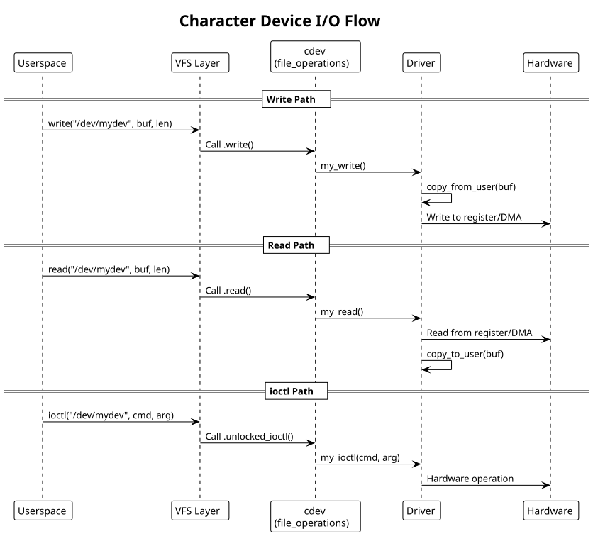

:PROPERTIES:
:ID:       d1e2f3g4-h5i6-4789-99a1-b2c3d4e5f6a7
:END:
#+title: Character Drivers
#+author: Arun Jyothish K
#+filetags: :drivers:char:device-files:

*Character device drivers: device files, read/write, ioctl, mmap. Includes LED controller example.*

** Device File Interface

Character devices provide byte-stream I/O via device files (e.g., =/dev/ttyUSB0=, =/dev/null=).

Kernel exports device via =cdev= (character device) abstraction:

#+begin_src c
#include <linux/cdev.h>
#include <linux/fs.h>

struct my_dev {
    struct cdev cdev;
    dev_t devno;
    struct device *device;
    void __iomem *base;
    spinlock_t lock;
};

static struct my_dev *global_dev = NULL;
#+end_src

** File Operations

Kernel calls file_operations methods when userspace reads/writes/ioctls:

#+begin_src c
static long my_ioctl(struct file *filp, unsigned int cmd, unsigned long arg)
{
    struct my_dev *dev = filp->private_data;

    switch (cmd) {
    case IOCTL_SET_LED:
        // Copy from userspace
        u32 val;
        if (copy_from_user(&val, (void __user *)arg, sizeof(val)))
            return -EFAULT;

        // Write to hardware
        writel(val, dev->base + LED_REGISTER);
        break;

    case IOCTL_GET_STATUS:
        u32 status = readl(dev->base + STATUS_REGISTER);
        if (copy_to_user((void __user *)arg, &status, sizeof(status)))
            return -EFAULT;
        break;

    default:
        return -ENOTTY;
    }
    return 0;
}

static ssize_t my_read(struct file *filp, char __user *buf, size_t count, loff_t *pos)
{
    struct my_dev *dev = filp->private_data;

    if (*pos >= 4)  // 32-bit register
        return 0;

    if (count > 4 - *pos)
        count = 4 - *pos;

    u32 val = readl(dev->base + DATA_REGISTER);
    if (copy_to_user(buf, &val, count))
        return -EFAULT;

    *pos += count;
    return count;
}

static ssize_t my_write(struct file *filp, const char __user *buf, size_t count, loff_t *pos)
{
    struct my_dev *dev = filp->private_data;

    if (count > 4)
        count = 4;

    u32 val = 0;
    if (copy_from_user(&val, buf, count))
        return -EFAULT;

    writel(val, dev->base + CMD_REGISTER);

    *pos += count;
    return count;
}

static int my_open(struct inode *inode, struct file *filp)
{
    struct my_dev *dev = container_of(inode->i_cdev, struct my_dev, cdev);
    filp->private_data = dev;
    return 0;
}

static int my_release(struct inode *inode, struct file *filp)
{
    return 0;
}

static const struct file_operations my_fops = {
    .owner = THIS_MODULE,
    .open = my_open,
    .release = my_release,
    .read = my_read,
    .write = my_write,
    .unlocked_ioctl = my_ioctl,
};
#+end_src

** Device Registration

Register character device and create device file:

#+begin_src c
static int my_probe(struct platform_device *pdev)
{
    struct my_dev *dev;
    int ret;

    dev = devm_kzalloc(&pdev->dev, sizeof(*dev), GFP_KERNEL);
    if (!dev)
        return -ENOMEM;

    // Get memory resource
    struct resource *res = platform_get_resource(pdev, IORESOURCE_MEM, 0);
    dev->base = devm_ioremap_resource(&pdev->dev, res);
    if (IS_ERR(dev->base))
        return PTR_ERR(dev->base);

    // Allocate device number (dynamic allocation preferred)
    ret = alloc_chrdev_region(&dev->devno, 0, 1, "my_dev");
    if (ret < 0) {
        dev_err(&pdev->dev, "alloc_chrdev_region failed\n");
        return ret;
    }

    // Initialize and add cdev
    cdev_init(&dev->cdev, &my_fops);
    dev->cdev.owner = THIS_MODULE;
    ret = cdev_add(&dev->cdev, dev->devno, 1);
    if (ret < 0) {
        dev_err(&pdev->dev, "cdev_add failed\n");
        unregister_chrdev_region(dev->devno, 1);
        return ret;
    }

    // Create device file (/dev/my_dev_0)
    dev->device = device_create(my_class, &pdev->dev, dev->devno,
                                 dev, "my_dev_%d", 0);
    if (IS_ERR(dev->device)) {
        cdev_del(&dev->cdev);
        unregister_chrdev_region(dev->devno, 1);
        return PTR_ERR(dev->device);
    }

    platform_set_drvdata(pdev, dev);
    dev_info(&pdev->dev, "device registered at /dev/my_dev_0\n");

    return 0;
}

static int my_remove(struct platform_device *pdev)
{
    struct my_dev *dev = platform_get_drvdata(pdev);

    device_destroy(my_class, dev->devno);
    cdev_del(&dev->cdev);
    unregister_chrdev_region(dev->devno, 1);

    return 0;
}

static struct class *my_class = NULL;

static int __init my_init(void)
{
    my_class = class_create(THIS_MODULE, "my_dev");
    if (IS_ERR(my_class))
        return PTR_ERR(my_class);

    platform_driver_register(&my_driver);
    return 0;
}

static void __exit my_exit(void)
{
    platform_driver_unregister(&my_driver);
    class_destroy(my_class);
}

module_init(my_init);
module_exit(my_exit);
#+end_src

** Example: LED Controller Driver

Simple LED controller with read/write and ioctl:

#+begin_src c
// led_controller.c
#include <linux/module.h>
#include <linux/platform_device.h>
#include <linux/cdev.h>
#include <linux/fs.h>
#include <linux/io.h>
#include <uapi/linux/ioctl.h>

#define LED_MAGIC 'L'
#define IOCTL_SET_BRIGHTNESS _IOW(LED_MAGIC, 1, u32)
#define IOCTL_GET_STATUS _IOR(LED_MAGIC, 2, u32)

struct led_dev {
    struct cdev cdev;
    dev_t devno;
    void __iomem *base;
    struct device *device;
};

#define LED_REG_CONTROL 0x00
#define LED_REG_STATUS  0x04

static long led_ioctl(struct file *f, unsigned int cmd, unsigned long arg)
{
    struct led_dev *led = f->private_data;

    if (cmd == IOCTL_SET_BRIGHTNESS) {
        u32 val;
        if (copy_from_user(&val, (void __user *)arg, sizeof(val)))
            return -EFAULT;
        writel(val & 0xFF, led->base + LED_REG_CONTROL);
    } else if (cmd == IOCTL_GET_STATUS) {
        u32 status = readl(led->base + LED_REG_STATUS);
        if (copy_to_user((void __user *)arg, &status, sizeof(status)))
            return -EFAULT;
    } else {
        return -ENOTTY;
    }
    return 0;
}

static const struct file_operations led_fops = {
    .owner = THIS_MODULE,
    .unlocked_ioctl = led_ioctl,
};

static const struct of_device_id led_dt_match[] = {
    { .compatible = "vendor,led-controller" },
    { },
};
MODULE_DEVICE_TABLE(of, led_dt_match);

static int led_probe(struct platform_device *pdev)
{
    struct led_dev *led;
    struct resource *res;
    int ret;

    led = devm_kzalloc(&pdev->dev, sizeof(*led), GFP_KERNEL);
    if (!led)
        return -ENOMEM;

    res = platform_get_resource(pdev, IORESOURCE_MEM, 0);
    led->base = devm_ioremap_resource(&pdev->dev, res);
    if (IS_ERR(led->base))
        return PTR_ERR(led->base);

    alloc_chrdev_region(&led->devno, 0, 1, "led");
    cdev_init(&led->cdev, &led_fops);
    cdev_add(&led->cdev, led->devno, 1);

    led->device = device_create(NULL, &pdev->dev, led->devno, led, "led");

    platform_set_drvdata(pdev, led);
    return 0;
}

static int led_remove(struct platform_device *pdev)
{
    struct led_dev *led = platform_get_drvdata(pdev);
    device_destroy(NULL, led->devno);
    cdev_del(&led->cdev);
    unregister_chrdev_region(led->devno, 1);
    return 0;
}

static struct platform_driver led_driver = {
    .driver = {
        .name = "led-controller",
        .of_match_table = led_dt_match,
    },
    .probe = led_probe,
    .remove = led_remove,
};

module_platform_driver(led_driver);

MODULE_LICENSE("GPL");
MODULE_AUTHOR("Your Name");
MODULE_DESCRIPTION("LED controller driver");
#+end_src

** Userspace Usage

#+begin_src c
// user_led_app.c
#include <fcntl.h>
#include <sys/ioctl.h>
#include <stdio.h>
#include <stdint.h>

#define LED_MAGIC 'L'
#define IOCTL_SET_BRIGHTNESS _IOW(LED_MAGIC, 1, uint32_t)
#define IOCTL_GET_STATUS _IOR(LED_MAGIC, 2, uint32_t)

int main() {
    int fd = open("/dev/led", O_RDWR);

    // Set brightness to 75%
    uint32_t brightness = 192;  // 75% of 255
    ioctl(fd, IOCTL_SET_BRIGHTNESS, &brightness);

    // Read status
    uint32_t status;
    ioctl(fd, IOCTL_GET_STATUS, &status);
    printf("LED status: 0x%x\n", status);

    close(fd);
    return 0;
}
#+end_src

** Character Device I/O Flow Diagram

#+begin_src plantuml :file res/03-char-device-io.svg
!theme plain
title Character Device I/O Flow

participant Userspace
participant VFS as "VFS Layer"
participant CharDev as "cdev\n(file_operations)"
participant Driver
participant Hardware

== Write Path ==
Userspace -> VFS: write("/dev/mydev", buf, len)
VFS -> CharDev: Call .write()
CharDev -> Driver: my_write()
Driver -> Driver: copy_from_user(buf)
Driver -> Hardware: Write to register/DMA

== Read Path ==
Userspace -> VFS: read("/dev/mydev", buf, len)
VFS -> CharDev: Call .read()
CharDev -> Driver: my_read()
Driver -> Hardware: Read from register/DMA
Driver -> Driver: copy_to_user(buf)

== ioctl Path ==
Userspace -> VFS: ioctl("/dev/mydev", cmd, arg)
VFS -> CharDev: Call .unlocked_ioctl()
CharDev -> Driver: my_ioctl(cmd, arg)
Driver -> Hardware: Hardware operation
#+end_src

** Common Patterns

- Use =devm_*= allocators for automatic cleanup
- Always check =copy_to_user()= and =copy_from_user()= return values
- Use =container_of()= to recover device struct from cdev
- Handle partial reads/writes with loff_t
- Use device classes for automatic /dev creation

** See Also
- [[id:f1a2b3c4-d5e6-47f8-99a1-b2c3d4e5f6a7][Kernel Module Fundamentals]]
- [[id:c1d2e3f4-g5h6-4789-99a1-b2c3d4e5f6a7][Kernel Build System (Kbuild)]]
- [[id:i1j2k3l4-m5n6-4789-99a1-b2c3d4e5f6a7][Debugging Techniques]]
