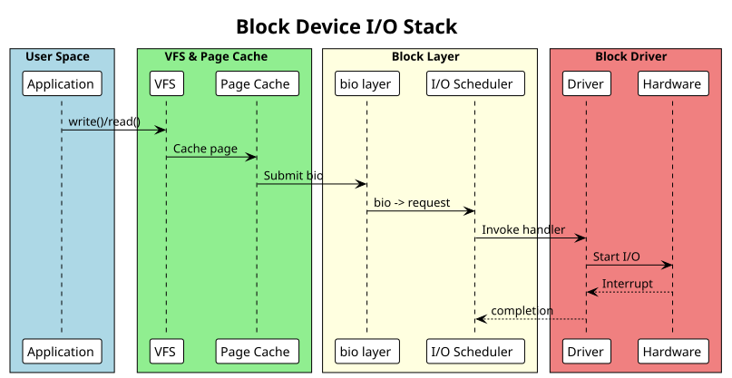

:PROPERTIES:
:ID:       e1f2g3h4-i5j6-4789-99a1-b2c3d4e5f6a7
:END:
#+title: Block Drivers
#+author: Arun Jyothish K
#+filetags: :drivers:block:storage:

*Block device drivers: request queue, I/O scheduling, bio layer. Includes ramdisk example.*

** Block Device Fundamentals

Block devices provide fixed-size sector access (typically 512 bytes or 4K). Examples: disk drives, USB storage, loop devices, ramdisk.

Block I/O stack:
- VFS layer → Block I/O layer (bio handling) → I/O scheduler → Block driver → Hardware

** Device Registration

#+begin_src c
#include <linux/blkdev.h>
#include <linux/genhd.h>

struct my_blk_dev {
    sector_t capacity;          // in sectors
    struct gendisk *disk;
    struct request_queue *queue;
    spinlock_t lock;
    u8 *data;                   // storage buffer (ramdisk)
};

static int my_probe(struct platform_device *pdev)
{
    struct my_blk_dev *dev;
    int ret;

    dev = devm_kzalloc(&pdev->dev, sizeof(*dev), GFP_KERNEL);
    if (!dev)
        return -ENOMEM;

    // Allocate storage (ramdisk example: 10MB)
    dev->capacity = 10 * 1024 * 1024 / 512;  // sectors
    dev->data = devm_kmalloc(&pdev->dev, dev->capacity * 512, GFP_KERNEL);
    if (!dev->data)
        return -ENOMEM;

    spin_lock_init(&dev->lock);

    // Allocate request queue
    dev->queue = blk_alloc_queue(GFP_KERNEL);
    if (!dev->queue)
        return -ENOMEM;

    // Set I/O request handler
    blk_queue_make_request(dev->queue, my_make_request);

    // Allocate and initialize gendisk
    dev->disk = alloc_disk(1);  // 1 partition
    if (!dev->disk) {
        blk_cleanup_queue(dev->queue);
        return -ENOMEM;
    }

    dev->disk->major = MY_MAJOR;
    dev->disk->first_minor = 0;
    dev->disk->fops = &my_blk_fops;
    dev->disk->private_data = dev;
    dev->disk->queue = dev->queue;
    snprintf(dev->disk->disk_name, 32, "myblk");

    set_capacity(dev->disk, dev->capacity);
    add_disk(dev->disk);

    platform_set_drvdata(pdev, dev);
    pr_info("Block device registered: /dev/myblk\n");

    return 0;
}

static int my_remove(struct platform_device *pdev)
{
    struct my_blk_dev *dev = platform_get_drvdata(pdev);

    del_gendisk(dev->disk);
    put_disk(dev->disk);
    blk_cleanup_queue(dev->queue);

    return 0;
}
#+end_src

** Make Request Handler

The =make_request()= callback processes bio (block I/O) structures:

#+begin_src c
static blk_qc_t my_make_request(struct request_queue *q, struct bio *bio)
{
    struct my_blk_dev *dev = bio->bi_disk->private_data;
    struct bio_vec bvec;
    struct bvec_iter iter;
    sector_t sector = bio->bi_iter.bi_sector;

    // Validate sector range
    if ((sector + bio_sectors(bio)) > dev->capacity) {
        bio_io_error(bio);
        return BLK_QC_T_NONE;
    }

    // Process each page in the bio
    bio_for_each_segment(bvec, bio, iter) {
        unsigned long offset = sector * 512;

        if (bio_data_dir(bio) == READ) {
            // Read from storage
            memcpy(page_address(bvec.bv_page) + bvec.bv_offset,
                   dev->data + offset, bvec.bv_len);
        } else {
            // Write to storage
            memcpy(dev->data + offset,
                   page_address(bvec.bv_page) + bvec.bv_offset,
                   bvec.bv_len);
        }

        sector += bvec.bv_len / 512;
    }

    // Signal completion
    bio_endio(bio);

    return BLK_QC_T_NONE;
}
#+end_src

** Request Queue Handler (Alternative)

For drivers using request queues instead of direct bio handling:

#+begin_src c
static void my_request_fn(struct request_queue *q)
{
    struct request *req;

    while ((req = blk_fetch_request(q)) != NULL) {
        struct my_blk_dev *dev = req->rq_disk->private_data;

        if (req->cmd_type != REQ_TYPE_FS) {
            __blk_end_request_all(req, -EIO);
            continue;
        }

        sector_t sector = blk_rq_pos(req);
        unsigned int nsects = blk_rq_sectors(req);

        // Validate
        if ((sector + nsects) > dev->capacity) {
            __blk_end_request_all(req, -EIO);
            continue;
        }

        // Process request
        rq_for_each_segment(bvec, req, iter) {
            unsigned long offset = sector * 512;
            void *from, *to;

            if (rq_data_dir(req) == READ) {
                from = dev->data + offset;
                to = page_address(bvec.bv_page) + bvec.bv_offset;
            } else {
                from = page_address(bvec.bv_page) + bvec.bv_offset;
                to = dev->data + offset;
            }

            memcpy(to, from, bvec.bv_len);
            sector += bvec.bv_len / 512;
        }

        __blk_end_request_all(req, 0);
    }
}
#+end_src

** Block Device File Operations

#+begin_src c
static int my_open(struct block_device *bdev, fmode_t mode)
{
    return 0;
}

static void my_release(struct gendisk *disk, fmode_t mode)
{
}

static int my_ioctl(struct block_device *bdev, fmode_t mode, unsigned int cmd, unsigned long arg)
{
    return -ENOTTY;
}

static const struct block_device_operations my_blk_fops = {
    .owner = THIS_MODULE,
    .open = my_open,
    .release = my_release,
    .ioctl = my_ioctl,
};
#+end_src

** Example: Ramdisk Driver

Minimal in-memory block device:

#+begin_src c
// ramdisk.c
#include <linux/module.h>
#include <linux/platform_device.h>
#include <linux/blkdev.h>
#include <linux/genhd.h>

#define RAMDISK_SIZE (10 * 1024 * 1024)  // 10MB
#define SECTOR_SIZE 512

struct ramdisk_dev {
    struct gendisk *disk;
    struct request_queue *queue;
    u8 *data;
    sector_t capacity;
};

static blk_qc_t ramdisk_make_request(struct request_queue *q, struct bio *bio)
{
    struct ramdisk_dev *dev = bio->bi_disk->private_data;
    struct bio_vec bvec;
    struct bvec_iter iter;
    sector_t sector = bio->bi_iter.bi_sector;

    if ((sector + bio_sectors(bio)) > dev->capacity) {
        bio_io_error(bio);
        return BLK_QC_T_NONE;
    }

    bio_for_each_segment(bvec, bio, iter) {
        unsigned long offset = sector * SECTOR_SIZE;

        if (bio_data_dir(bio) == READ) {
            memcpy(page_address(bvec.bv_page) + bvec.bv_offset,
                   dev->data + offset, bvec.bv_len);
        } else {
            memcpy(dev->data + offset,
                   page_address(bvec.bv_page) + bvec.bv_offset,
                   bvec.bv_len);
        }

        sector += bvec.bv_len / SECTOR_SIZE;
    }

    bio_endio(bio);
    return BLK_QC_T_NONE;
}

static const struct block_device_operations ramdisk_fops = {
    .owner = THIS_MODULE,
};

static int ramdisk_probe(struct platform_device *pdev)
{
    struct ramdisk_dev *dev;

    dev = devm_kzalloc(&pdev->dev, sizeof(*dev), GFP_KERNEL);
    if (!dev)
        return -ENOMEM;

    dev->capacity = RAMDISK_SIZE / SECTOR_SIZE;
    dev->data = devm_kmalloc(&pdev->dev, RAMDISK_SIZE, GFP_KERNEL);
    if (!dev->data)
        return -ENOMEM;

    dev->queue = blk_alloc_queue(GFP_KERNEL);
    blk_queue_make_request(dev->queue, ramdisk_make_request);

    dev->disk = alloc_disk(1);
    dev->disk->major = 240;  // Use reserved major
    dev->disk->first_minor = 0;
    dev->disk->fops = &ramdisk_fops;
    dev->disk->private_data = dev;
    dev->disk->queue = dev->queue;
    snprintf(dev->disk->disk_name, 32, "ramdisk");

    set_capacity(dev->disk, dev->capacity);
    add_disk(dev->disk);

    platform_set_drvdata(pdev, dev);
    pr_info("Ramdisk device registered\n");

    return 0;
}

static int ramdisk_remove(struct platform_device *pdev)
{
    struct ramdisk_dev *dev = platform_get_drvdata(pdev);

    del_gendisk(dev->disk);
    put_disk(dev->disk);
    blk_cleanup_queue(dev->queue);

    return 0;
}

static struct platform_driver ramdisk_driver = {
    .driver = { .name = "ramdisk" },
    .probe = ramdisk_probe,
    .remove = ramdisk_remove,
};

module_platform_driver(ramdisk_driver);

MODULE_LICENSE("GPL");
MODULE_AUTHOR("Your Name");
MODULE_DESCRIPTION("Ramdisk block device driver");
#+end_src

** Queue Configuration

Common queue setup:

#+begin_src c
// Set sector size
blk_queue_logical_block_size(queue, 4096);

// Set maximum I/O size
blk_queue_max_hw_sectors(queue, 256);

// Set DMA alignment
blk_queue_dma_alignment(queue, 511);

// Disable I/O scheduler (for SSD-like devices)
queue->elevator = NULL;
#+end_src

** User Interaction

#+begin_src bash
# List block devices
lsblk

# Read from ramdisk
dd if=/dev/ramdisk bs=512 count=1

# Write to ramdisk
dd if=/bin/sh of=/dev/ramdisk bs=512 count=1

# Check device info
blockdev --getsize64 /dev/ramdisk

# Monitor I/O
iostat -x 1 /dev/ramdisk
#+end_src

** Block I/O Stack Diagram

#+begin_src plantuml :file res/04-block-io-stack.svg
!theme plain
title Block Device I/O Stack

box "User Space" #LightBlue
  participant Userspace as "Application"
end box

box "VFS & Page Cache" #LightGreen
  participant VFS
  participant PageCache as "Page Cache"
end box

box "Block Layer" #LightYellow
  participant BIO as "bio layer"
  participant Scheduler as "I/O Scheduler"
end box

box "Block Driver" #LightCoral
  participant Driver
  participant Hardware
end box

Userspace -> VFS: write()/read()
VFS -> PageCache: Cache page
PageCache -> BIO: Submit bio
BIO -> Scheduler: bio -> request
Scheduler -> Driver: Invoke handler
Driver -> Hardware: Start I/O
Hardware --> Driver: Interrupt
Driver --> Scheduler: completion
#+end_src

** See Also
- [[id:f1a2b3c4-d5e6-47f8-99a1-b2c3d4e5f6a7][Kernel Module Fundamentals]]
- [[id:i1j2k3l4-m5n6-4789-99a1-b2c3d4e5f6a7][Debugging Techniques]]
