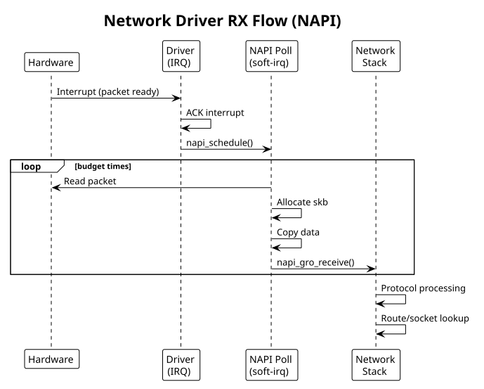

:PROPERTIES:
:ID:       f1g2h3i4-j5k6-4789-99a1-b2c3d4e5f6a7
:END:
#+title: Network Drivers
#+author: Arun Jyothish K
#+filetags: :drivers:network:netdev:skbuff:

*Network device drivers: netdev_ops, skbuff (sk_buff), packet handling. Includes virtual ethernet example.*

** Network Device Fundamentals

Network drivers provide packet I/O. Kernel abstracts as =struct net_device=:
- RX: receive packets from hardware, allocate skbuff, pass to net stack
- TX: net stack provides skbuff, driver sends to hardware

** Device Registration

#+begin_src c
#include <linux/netdevice.h>
#include <linux/etherdevice.h>

struct my_netdev {
    struct net_device *netdev;
    void __iomem *base;
    spinlock_t lock;
    struct napi_struct napi;
    struct sk_buff_head rx_queue;
};

static const struct net_device_ops my_netdev_ops = {
    .ndo_open = my_open,
    .ndo_stop = my_close,
    .ndo_start_xmit = my_xmit,
    .ndo_set_rx_mode = my_set_multicast_list,
    .ndo_set_mac_address = eth_mac_addr,
    .ndo_validate_addr = eth_validate_addr,
};

static int my_probe(struct platform_device *pdev)
{
    struct my_netdev *dev;
    struct net_device *netdev;
    int ret;

    // Allocate net_device with private data
    netdev = devm_alloc_etherdev(&pdev->dev, sizeof(*dev));
    if (!netdev)
        return -ENOMEM;

    dev = netdev_priv(netdev);
    dev->netdev = netdev;

    // Set MAC address (random or from DTS)
    eth_hw_addr_random(netdev);

    // Assign operations
    netdev->netdev_ops = &my_netdev_ops;

    // Get I/O memory
    struct resource *res = platform_get_resource(pdev, IORESOURCE_MEM, 0);
    dev->base = devm_ioremap_resource(&pdev->dev, res);
    if (IS_ERR(dev->base))
        return PTR_ERR(dev->base);

    // Initialize NAPI
    netif_napi_add(netdev, &dev->napi, my_poll, 64);

    spin_lock_init(&dev->lock);
    skb_queue_head_init(&dev->rx_queue);

    // Register device
    ret = register_netdev(netdev);
    if (ret) {
        devm_free_netdev(&pdev->dev, netdev);
        return ret;
    }

    platform_set_drvdata(pdev, dev);
    netdev_info(netdev, "registered\n");

    return 0;
}

static int my_remove(struct platform_device *pdev)
{
    struct my_netdev *dev = platform_get_drvdata(pdev);

    unregister_netdev(dev->netdev);
    devm_free_netdev(&pdev->dev, dev->netdev);

    return 0;
}
#+end_src

** Open/Close

#+begin_src c
static int my_open(struct net_device *netdev)
{
    struct my_netdev *dev = netdev_priv(netdev);

    // Enable interrupts, start hardware, allocate RX buffers
    netif_carrier_on(netdev);
    netif_start_queue(netdev);
    napi_enable(&dev->napi);

    return 0;
}

static int my_close(struct net_device *netdev)
{
    struct my_netdev *dev = netdev_priv(netdev);

    napi_disable(&dev->napi);
    netif_stop_queue(netdev);
    netif_carrier_off(netdev);

    // Disable interrupts, stop hardware

    return 0;
}
#+end_src

** Transmit (TX)

Net stack calls =ndo_start_xmit()= with packet to send:

#+begin_src c
static netdev_tx_t my_xmit(struct sk_buff *skb, struct net_device *netdev)
{
    struct my_netdev *dev = netdev_priv(netdev);
    unsigned long flags;

    spin_lock_irqsave(&dev->lock, flags);

    // Check if TX queue is available
    if (netdev_xmit_stopped(netdev)) {
        spin_unlock_irqrestore(&dev->lock, flags);
        return NETDEV_TX_BUSY;
    }

    // Write packet to hardware
    // - copy skb data to TX DMA buffer
    dma_addr_t dma_addr = dma_map_single(&dev->netdev->dev, skb->data,
                                         skb->len, DMA_TO_DEVICE);
    if (dma_mapping_error(&dev->netdev->dev, dma_addr)) {
        spin_unlock_irqrestore(&dev->lock, flags);
        dev_kfree_skb_any(skb);
        return NETDEV_TX_OK;
    }

    // Start DMA transfer
    writel(dma_addr, dev->base + TX_ADDR_REG);
    writel(skb->len, dev->base + TX_LEN_REG);
    writel(TX_START, dev->base + TX_CTRL_REG);

    // Update stats
    netdev->stats.tx_packets++;
    netdev->stats.tx_bytes += skb->len;

    spin_unlock_irqrestore(&dev->lock, flags);

    // Device owns the skb now (will free in TX completion IRQ)
    dev_kfree_skb(skb);

    return NETDEV_TX_OK;
}
#+end_src

** Receive (RX) - NAPI Poll

Use NAPI (New API) for receive processing — more efficient than interrupt-per-packet:

#+begin_src c
static int my_poll(struct napi_struct *napi, int budget)
{
    struct my_netdev *dev = container_of(napi, struct my_netdev, napi);
    struct net_device *netdev = dev->netdev;
    int npackets = 0;

    while (npackets < budget) {
        struct sk_buff *skb;
        unsigned int len;
        dma_addr_t dma_addr;

        // Check if packet available in hardware
        if (!(readl(dev->base + RX_STATUS_REG) & RX_AVAIL))
            break;

        // Get packet length from hardware
        len = readl(dev->base + RX_LEN_REG);
        if (len < ETH_HLEN || len > ETH_DATA_LEN) {
            netdev->stats.rx_errors++;
            goto next_packet;
        }

        // Allocate skbuff
        skb = napi_alloc_skb(napi, len);
        if (!skb) {
            netdev->stats.rx_dropped++;
            goto next_packet;
        }

        // Copy packet data
        dma_addr = dma_map_single(&netdev->dev, skb->data, len,
                                  DMA_FROM_DEVICE);
        if (dma_mapping_error(&netdev->dev, dma_addr)) {
            kfree_skb(skb);
            goto next_packet;
        }

        // Simulate DMA from hardware (in real driver, hardware fills buffer)
        // memcpy(skb->data, dev->base + RX_BUF, len);

        dma_unmap_single(&netdev->dev, dma_addr, len, DMA_FROM_DEVICE);
        skb_put(skb, len);

        // Set protocol and pass to stack
        skb->protocol = eth_type_trans(skb, netdev);
        napi_gro_receive(napi, skb);

        netdev->stats.rx_packets++;
        netdev->stats.rx_bytes += len;

    next_packet:
        // Signal hardware: packet processed
        writel(1, dev->base + RX_NEXT_REG);
        npackets++;
    }

    // If we got fewer packets than budget, exit polling
    if (npackets < budget) {
        napi_complete_done(napi, npackets);
        // Re-enable RX interrupts
        writel(readl(dev->base + IRQ_EN_REG) | RX_IRQ, dev->base + IRQ_EN_REG);
    }

    return npackets;
}

// Interrupt handler
static irqreturn_t my_isr(int irq, void *dev_id)
{
    struct my_netdev *dev = dev_id;
    u32 status = readl(dev->base + IRQ_STATUS_REG);

    if (!(status & (RX_IRQ | TX_IRQ)))
        return IRQ_NONE;

    // Acknowledge interrupts
    writel(status, dev->base + IRQ_STATUS_REG);

    if (status & RX_IRQ) {
        // Disable RX interrupts, schedule NAPI poll
        writel(readl(dev->base + IRQ_EN_REG) & ~RX_IRQ, dev->base + IRQ_EN_REG);
        napi_schedule(&dev->napi);
    }

    if (status & TX_IRQ) {
        // Handle TX completion
    }

    return IRQ_HANDLED;
}
#+end_src

** skbuff (Socket Buffer)

skbuff structure holds packet data and metadata:

#+begin_src c
struct sk_buff {
    unsigned char *head;     // allocated data pointer
    unsigned char *data;     // current data start (MAC header)
    unsigned char *tail;     // current data end
    unsigned char *end;      // allocated end

    unsigned int len;        // payload length
    unsigned int data_len;   // frags + frag_list length

    __u16 protocol;          // Ethernet type

    struct net_device *dev;  // input device
    struct dst_entry *dst;   // routing

    // ... many more fields
};

// Common operations
skb_put(skb, len);              // extend data end
skb_push(skb, len);             // prepend header space
skb_pull(skb, len);             // trim from head
skb_reserve(skb, len);          // skip at start
skb_headroom(skb);              // space before data
skb_tailroom(skb);              // space after data
#+end_src

** Example: Virtual Ethernet Driver

Simple virtual network device:

#+begin_src c
// veth_driver.c
#include <linux/module.h>
#include <linux/netdevice.h>
#include <linux/etherdevice.h>

struct veth_dev {
    struct net_device *netdev;
    struct napi_struct napi;
    struct sk_buff_head rx_queue;
};

static netdev_tx_t veth_xmit(struct sk_buff *skb, struct net_device *netdev)
{
    struct veth_dev *dev = netdev_priv(netdev);

    // Simulate loopback: queue packet for RX
    skb_queue_tail(&dev->rx_queue, skb);
    napi_schedule(&dev->napi);

    netdev->stats.tx_packets++;
    netdev->stats.tx_bytes += skb->len;

    return NETDEV_TX_OK;
}

static int veth_poll(struct napi_struct *napi, int budget)
{
    struct veth_dev *dev = container_of(napi, struct veth_dev, napi);
    struct net_device *netdev = dev->netdev;
    int npackets = 0;

    while (npackets < budget) {
        struct sk_buff *skb = skb_dequeue(&dev->rx_queue);

        if (!skb)
            break;

        skb->protocol = eth_type_trans(skb, netdev);
        napi_gro_receive(napi, skb);

        netdev->stats.rx_packets++;
        netdev->stats.rx_bytes += skb->len;
        npackets++;
    }

    if (npackets < budget)
        napi_complete_done(napi, npackets);

    return npackets;
}

static const struct net_device_ops veth_ops = {
    .ndo_start_xmit = veth_xmit,
};

static int veth_probe(struct platform_device *pdev)
{
    struct net_device *netdev;
    struct veth_dev *dev;

    netdev = alloc_etherdev(sizeof(*dev));
    if (!netdev)
        return -ENOMEM;

    dev = netdev_priv(netdev);
    dev->netdev = netdev;

    eth_hw_addr_random(netdev);
    netdev->netdev_ops = &veth_ops;
    skb_queue_head_init(&dev->rx_queue);
    netif_napi_add(netdev, &dev->napi, veth_poll, 64);

    if (register_netdev(netdev) < 0) {
        free_netdev(netdev);
        return -ENODEV;
    }

    platform_set_drvdata(pdev, dev);
    netdev_info(netdev, "virtual ethernet registered\n");

    return 0;
}

static int veth_remove(struct platform_device *pdev)
{
    struct veth_dev *dev = platform_get_drvdata(pdev);

    unregister_netdev(dev->netdev);
    free_netdev(dev->netdev);

    return 0;
}

static struct platform_driver veth_driver = {
    .driver = { .name = "veth" },
    .probe = veth_probe,
    .remove = veth_remove,
};

module_platform_driver(veth_driver);

MODULE_LICENSE("GPL");
MODULE_AUTHOR("Your Name");
MODULE_DESCRIPTION("Virtual ethernet driver");
#+end_src

** Network RX Flow Diagram

#+begin_src plantuml :file res/05-network-rx-flow.svg
!theme plain
title Network Driver RX Flow (NAPI)

participant Hardware
participant Driver as "Driver\n(IRQ)"
participant NAPI as "NAPI Poll\n(soft-irq)"
participant NetStack as "Network\nStack"

Hardware -> Driver: Interrupt (packet ready)
Driver -> Driver: ACK interrupt
Driver -> NAPI: napi_schedule()

loop budget times
  NAPI -> Hardware: Read packet
  NAPI -> NAPI: Allocate skb
  NAPI -> NAPI: Copy data
  NAPI -> NetStack: napi_gro_receive()
end

NetStack -> NetStack: Protocol processing
NetStack -> NetStack: Route/socket lookup
#+end_src

** See Also
- [[id:f1a2b3c4-d5e6-47f8-99a1-b2c3d4e5f6a7][Kernel Module Fundamentals]]
- [[id:j1k2l3m4-n5o6-4789-99a1-b2c3d4e5f6a7][Performance Considerations]] — NAPI, RCU, lockless queues
- [[id:4fe1ea81-ea79-4b83-8435-83dea4337125][DMA & Memory Mapping]] — skbuff DMA mapping on TX/RX
- [[id:bee17a98-9ba2-49bb-8169-6f1ff0f0132b][Interrupt Handling]] — NAPI poll scheduling from the RX IRQ
