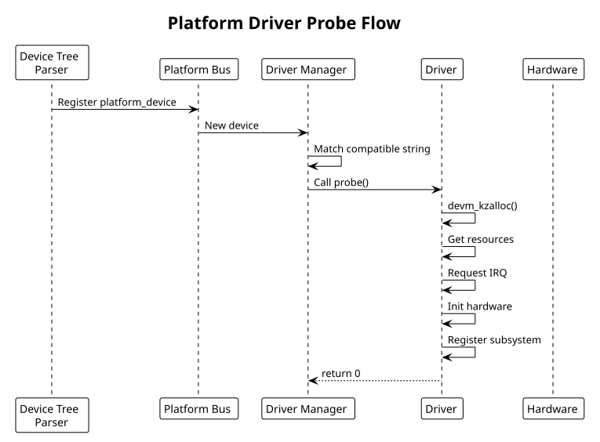

:PROPERTIES:
:ID:       g1h2i3j4-k5l6-4789-99a1-b2c3d4e5f6a7
:END:
#+title: Platform Drivers
#+author: Arun Jyothish K
#+filetags: :drivers:platform:device-tree:probe:

*Platform driver framework: device discovery, probe/remove lifecycle, device tree integration. Includes GPIO controller example.*

** Platform Driver Framework

Platform devices are discovered via device tree or platform data (rarely). Kernel matches devices with drivers via =compatible= string (DTS) or platform name (legacy).

Driver lifecycle:
1. Device discovered (DTS parsing or explicit registration)
2. Kernel searches for matching driver
3. Driver's =probe()= called
4. Driver initializes hardware, creates devices/files
5. On device removal, =remove()= called

** Driver Registration

#+begin_src c
#include <linux/platform_device.h>
#include <linux/of.h>
#include <linux/of_device.h>

static const struct of_device_id my_gpio_dt_match[] = {
    { .compatible = "vendor,gpio-controller", .data = (void *)1 },
    { .compatible = "vendor,gpio-v2", .data = (void *)2 },
    { /* terminator */ },
};
MODULE_DEVICE_TABLE(of, my_gpio_dt_match);

static int my_gpio_probe(struct platform_device *pdev)
{
    struct device *dev = &pdev->dev;
    struct device_node *np = pdev->dev.of_node;

    // ... probe logic

    return 0;
}

static int my_gpio_remove(struct platform_device *pdev)
{
    // ... cleanup
    return 0;
}

static struct platform_driver my_gpio_driver = {
    .driver = {
        .name = "vendor-gpio",
        .owner = THIS_MODULE,
        .of_match_table = my_gpio_dt_match,
    },
    .probe = my_gpio_probe,
    .remove = my_gpio_remove,
};

// Register driver
module_platform_driver(my_gpio_driver);
// Equivalent to:
// module_init(platform_driver_register(&my_gpio_driver));
// module_exit(platform_driver_unregister(&my_gpio_driver));
#+end_src

** Probe Function

Probe runs when device is discovered. Must initialize hardware and export interfaces:

#+begin_src c
static int my_gpio_probe(struct platform_device *pdev)
{
    struct device *dev = &pdev->dev;
    struct device_node *np = dev->of_node;
    struct my_gpio_dev *gpio_dev;
    struct resource *res;
    int irq, ret;

    // Allocate device struct
    gpio_dev = devm_kzalloc(dev, sizeof(*gpio_dev), GFP_KERNEL);
    if (!gpio_dev)
        return -ENOMEM;

    // Extract base address from reg property
    res = platform_get_resource(pdev, IORESOURCE_MEM, 0);
    gpio_dev->base = devm_ioremap_resource(dev, res);
    if (IS_ERR(gpio_dev->base))
        return PTR_ERR(gpio_dev->base);

    gpio_dev->phys = res->start;
    gpio_dev->size = resource_size(res);

    // Extract IRQ from interrupts property
    irq = platform_get_irq(pdev, 0);
    if (irq < 0) {
        dev_err(dev, "failed to get IRQ\n");
        return irq;
    }

    // Read DTS properties
    u32 ngpios;
    ret = of_property_read_u32(np, "ngpios", &ngpios);
    if (ret < 0) {
        dev_warn(dev, "ngpios not specified, using default\n");
        ngpios = 32;
    }

    gpio_dev->ngpios = ngpios;
    spin_lock_init(&gpio_dev->lock);

    // Request IRQ
    ret = devm_request_irq(dev, irq, my_gpio_isr, IRQF_SHARED,
                          dev_name(dev), gpio_dev);
    if (ret < 0) {
        dev_err(dev, "failed to request IRQ\n");
        return ret;
    }

    // Register with GPIO subsystem
    ret = my_gpio_register_gpiochip(gpio_dev);
    if (ret < 0)
        return ret;

    // Store private data for later use
    platform_set_drvdata(pdev, gpio_dev);

    dev_info(dev, "GPIO controller registered: %u pins\n", ngpios);

    return 0;
}
#+end_src

** Remove Function

Clean up resources:

#+begin_src c
static int my_gpio_remove(struct platform_device *pdev)
{
    struct my_gpio_dev *gpio_dev = platform_get_drvdata(pdev);

    // Unregister GPIO chip
    gpiochip_remove(&gpio_dev->chip);

    // Unregister sysfs attributes (auto-cleanup if used devm_device_add_group)

    // IRQ and memory freed automatically (devm_)

    return 0;
}
#+end_src

** Example: GPIO Controller Driver

Complete platform driver for GPIO controller:

#+begin_src c
// gpio_controller.c
#include <linux/module.h>
#include <linux/platform_device.h>
#include <linux/gpio/driver.h>
#include <linux/of.h>
#include <linux/of_device.h>
#include <linux/io.h>

#define GPIO_MAX_PINS 32

struct my_gpio_dev {
    struct gpio_chip chip;
    void __iomem *base;
    spinlock_t lock;
    int irq;
};

#define GPIO_DIR_REG    0x00    // direction: 0=output, 1=input
#define GPIO_DATA_REG   0x04    // data value
#define GPIO_IRQ_EN_REG 0x08    // interrupt enable
#define GPIO_IRQ_ST_REG 0x0c    // interrupt status

// GPIO operations
static int my_gpio_get_direction(struct gpio_chip *chip, unsigned offset)
{
    struct my_gpio_dev *dev = gpiochip_get_data(chip);
    u32 dir = readl(dev->base + GPIO_DIR_REG);
    return (dir >> offset) & 1;  // 1=input, 0=output
}

static void my_gpio_set_direction_out(struct gpio_chip *chip, unsigned offset)
{
    struct my_gpio_dev *dev = gpiochip_get_data(chip);
    unsigned long flags;
    u32 dir;

    spin_lock_irqsave(&dev->lock, flags);
    dir = readl(dev->base + GPIO_DIR_REG);
    dir &= ~(1 << offset);  // clear bit = output
    writel(dir, dev->base + GPIO_DIR_REG);
    spin_unlock_irqrestore(&dev->lock, flags);
}

static void my_gpio_set_direction_in(struct gpio_chip *chip, unsigned offset)
{
    struct my_gpio_dev *dev = gpiochip_get_data(chip);
    unsigned long flags;
    u32 dir;

    spin_lock_irqsave(&dev->lock, flags);
    dir = readl(dev->base + GPIO_DIR_REG);
    dir |= (1 << offset);  // set bit = input
    writel(dir, dev->base + GPIO_DIR_REG);
    spin_unlock_irqrestore(&dev->lock, flags);
}

static int my_gpio_get(struct gpio_chip *chip, unsigned offset)
{
    struct my_gpio_dev *dev = gpiochip_get_data(chip);
    u32 val = readl(dev->base + GPIO_DATA_REG);
    return (val >> offset) & 1;
}

static void my_gpio_set(struct gpio_chip *chip, unsigned offset, int val)
{
    struct my_gpio_dev *dev = gpiochip_get_data(chip);
    unsigned long flags;
    u32 data;

    spin_lock_irqsave(&dev->lock, flags);
    data = readl(dev->base + GPIO_DATA_REG);
    if (val)
        data |= (1 << offset);
    else
        data &= ~(1 << offset);
    writel(data, dev->base + GPIO_DATA_REG);
    spin_unlock_irqrestore(&dev->lock, flags);
}

static const struct gpio_chip my_gpio_chip = {
    .label = "vendor-gpio",
    .owner = THIS_MODULE,
    .get_direction = my_gpio_get_direction,
    .direction_output = my_gpio_set_direction_out,
    .direction_input = my_gpio_set_direction_in,
    .get = my_gpio_get,
    .set = my_gpio_set,
    .base = -1,  // dynamic allocation
    .ngpio = GPIO_MAX_PINS,
    .can_sleep = false,
};

// Interrupt handler
static irqreturn_t my_gpio_isr(int irq, void *dev_id)
{
    struct my_gpio_dev *dev = dev_id;
    u32 status = readl(dev->base + GPIO_IRQ_ST_REG);

    if (!status)
        return IRQ_NONE;

    // Clear interrupts
    writel(status, dev->base + GPIO_IRQ_ST_REG);

    // Handle GPIO interrupts (for interrupt-capable GPIO)
    generic_handle_irq(dev->irq);

    return IRQ_HANDLED;
}

static const struct of_device_id my_gpio_dt_match[] = {
    { .compatible = "vendor,gpio-controller" },
    { },
};
MODULE_DEVICE_TABLE(of, my_gpio_dt_match);

static int my_gpio_probe(struct platform_device *pdev)
{
    struct device *dev = &pdev->dev;
    struct my_gpio_dev *gpio_dev;
    struct resource *res;
    int irq, ret;

    gpio_dev = devm_kzalloc(dev, sizeof(*gpio_dev), GFP_KERNEL);
    if (!gpio_dev)
        return -ENOMEM;

    res = platform_get_resource(pdev, IORESOURCE_MEM, 0);
    gpio_dev->base = devm_ioremap_resource(dev, res);
    if (IS_ERR(gpio_dev->base))
        return PTR_ERR(gpio_dev->base);

    irq = platform_get_irq(pdev, 0);
    if (irq >= 0) {
        gpio_dev->irq = irq;
        ret = devm_request_irq(dev, irq, my_gpio_isr, IRQF_SHARED,
                              dev_name(dev), gpio_dev);
        if (ret < 0)
            dev_warn(dev, "failed to request IRQ\n");
    }

    spin_lock_init(&gpio_dev->lock);

    // Register with GPIO framework
    gpio_dev->chip = my_gpio_chip;
    gpio_dev->chip.parent = dev;

    ret = devm_gpiochip_add_data(dev, &gpio_dev->chip, gpio_dev);
    if (ret < 0) {
        dev_err(dev, "failed to register GPIO chip\n");
        return ret;
    }

    platform_set_drvdata(pdev, gpio_dev);
    dev_info(dev, "GPIO controller registered\n");

    return 0;
}

static int my_gpio_remove(struct platform_device *pdev)
{
    // Cleanup handled by devm
    return 0;
}

static struct platform_driver my_gpio_driver = {
    .driver = {
        .name = "vendor-gpio",
        .of_match_table = my_gpio_dt_match,
    },
    .probe = my_gpio_probe,
    .remove = my_gpio_remove,
};

module_platform_driver(my_gpio_driver);

MODULE_LICENSE("GPL");
MODULE_AUTHOR("Your Name");
MODULE_DESCRIPTION("GPIO controller driver");
#+end_src

** Device Tree Integration

#+begin_src dts
gpio_controller: gpio@1000 {
    compatible = "vendor,gpio-controller";
    reg = <0x1000 0x100>;
    ngpios = <32>;
    interrupts = <42 0>;
    #gpio-cells = <2>;
    gpio-controller;
    interrupt-controller;
    #interrupt-cells = <2>;
};

// GPIO reference in other devices
led: led@2000 {
    compatible = "vendor,led";
    reg = <0x2000 0x10>;
    gpios = <&gpio_controller 10 0>,
            <&gpio_controller 11 0>;
};
#+end_src

** Common Patterns

- Use =devm_*= allocators (automatic cleanup on probe failure/removal)
- Extract resources with =platform_get_resource()=, =platform_get_irq()=
- Read DTS properties with =of_property_read_*()=
- Use =container_of()= and =platform_set_drvdata()= for device association
- Always return non-zero error codes on probe failure
- Subsystem registration (GPIO, I2C, SPI) handles most of the sysfs/device file creation

** Platform Driver Probe Flow Diagram

#+begin_src plantuml :file res/06-platform-probe.svg
!theme plain
title Platform Driver Probe Flow

participant DTParser as "Device Tree\nParser"
participant PlatformBus as "Platform Bus"
participant DriverCore as "Driver Manager"
participant Driver
participant Hardware

DTParser -> PlatformBus: Register platform_device
PlatformBus -> DriverCore: New device
DriverCore -> DriverCore: Match compatible string
DriverCore -> Driver: Call probe()

Driver -> Driver: devm_kzalloc()
Driver -> Driver: Get resources
Driver -> Driver: Request IRQ
Driver -> Driver: Init hardware
Driver -> Driver: Register subsystem
Driver --> DriverCore: return 0
#+end_src

** See Also
- [[id:a1b2c3d4-e5f6-4789-99a1-b2c3d4e5f6a7][Device Tree (DTS) & Bindings]]
- [[id:f1a2b3c4-d5e6-47f8-99a1-b2c3d4e5f6a7][Kernel Module Fundamentals]]
- [[id:i1j2k3l4-m5n6-4789-99a1-b2c3d4e5f6a7][Debugging Techniques]]
- [[id:bee17a98-9ba2-49bb-8169-6f1ff0f0132b][Interrupt Handling]] — =platform_get_irq()= and requesting the resulting IRQ
- [[id:41bfcbfa-8054-4ff6-86e9-fc663348d7ed][I2C & SPI Subsystem Drivers]] — same probe/remove model on a different bus
- [[id:k1l2m3n4-o5p6-4789-99a1-b2c3d4e5f6a7][Linux Boot Sequence]] — platform driver probe during boot
