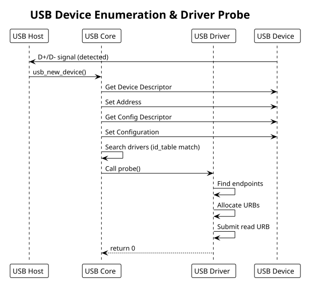

:PROPERTIES:
:ID:       h1i2j3k4-l5m6-4789-99a1-b2c3d4e5f6a7
:END:
#+title: USB Drivers
#+author: Arun Jyothish K
#+filetags: :drivers:usb:urb:hid:

*USB device drivers: URB (USB Request Block), endpoints, async transfers, HID. Includes simple USB device example.*

** USB Driver Fundamentals

USB drivers communicate via:
- *Descriptors*: device, config, interface, endpoint (static hardware metadata)
- *URBs*: USB Request Blocks (async transfer requests)
- *Endpoints*: unidirectional pipes (CONTROL, INTERRUPT, BULK, ISOC)

Kernel abstracts USB devices via =struct usb_device= and drivers via =struct usb_driver=.

** Driver Registration

#+begin_src c
#include <linux/usb.h>
#include <linux/usb/input.h>

// Device ID table (matches VID:PID pairs)
static const struct usb_device_id my_usb_devices[] = {
    { USB_DEVICE(0x1234, 0x5678) },      // Vendor ID 0x1234, Product ID 0x5678
    { USB_DEVICE(0x1234, 0x5679) },
    { /* terminator */ }
};
MODULE_DEVICE_TABLE(usb, my_usb_devices);

struct my_usb_dev {
    struct usb_device *udev;            // underlying USB device
    struct usb_interface *interface;    // selected interface
    unsigned char *bulk_in_buffer;
    size_t bulk_in_size;
    __u8 bulk_in_endpointAddr;
    __u8 bulk_out_endpointAddr;

    struct urb *bulk_in_urb;            // async read request
    struct urb *bulk_out_urb;           // async write request
};

static int my_usb_probe(struct usb_interface *intf,
                       const struct usb_device_id *id)
{
    struct usb_device *udev = interface_to_usbdev(intf);
    struct usb_host_interface *altsetting = intf->cur_altsetting;
    struct usb_endpoint_descriptor *endpoint;
    struct my_usb_dev *dev;
    int retval = -ENOMEM;
    int i;

    dev = kzalloc(sizeof(*dev), GFP_KERNEL);
    if (!dev)
        return -ENOMEM;

    dev->udev = usb_get_dev(udev);
    dev->interface = intf;

    // Find bulk endpoints
    for (i = 0; i < altsetting->desc.bNumEndpoints; i++) {
        endpoint = &altsetting->endpoint[i].desc;

        if (!dev->bulk_in_endpointAddr && usb_endpoint_is_bulk_in(endpoint)) {
            dev->bulk_in_endpointAddr = endpoint->bEndpointAddress;
            dev->bulk_in_size = usb_endpoint_maxp(endpoint);
        }

        if (!dev->bulk_out_endpointAddr && usb_endpoint_is_bulk_out(endpoint)) {
            dev->bulk_out_endpointAddr = endpoint->bEndpointAddress;
        }
    }

    if (!dev->bulk_in_endpointAddr || !dev->bulk_out_endpointAddr) {
        dev_err(&intf->dev, "Could not find bulk endpoints\n");
        retval = -ENODEV;
        goto error;
    }

    // Allocate RX buffer
    dev->bulk_in_buffer = kmalloc(dev->bulk_in_size, GFP_KERNEL);
    if (!dev->bulk_in_buffer) {
        retval = -ENOMEM;
        goto error;
    }

    // Create URBs
    dev->bulk_in_urb = usb_alloc_urb(0, GFP_KERNEL);
    if (!dev->bulk_in_urb) {
        retval = -ENOMEM;
        goto error;
    }

    dev->bulk_out_urb = usb_alloc_urb(0, GFP_KERNEL);
    if (!dev->bulk_out_urb) {
        retval = -ENOMEM;
        goto error;
    }

    // Register device for user access
    usb_set_intfdata(intf, dev);

    dev_info(&intf->dev, "USB device connected\n");
    return 0;

error:
    if (dev) {
        usb_free_urb(dev->bulk_in_urb);
        usb_free_urb(dev->bulk_out_urb);
        kfree(dev->bulk_in_buffer);
        usb_put_dev(dev->udev);
        kfree(dev);
    }
    return retval;
}

static void my_usb_disconnect(struct usb_interface *intf)
{
    struct my_usb_dev *dev = usb_get_intfdata(intf);

    usb_set_intfdata(intf, NULL);

    // Unlink pending URBs
    usb_kill_urb(dev->bulk_in_urb);
    usb_kill_urb(dev->bulk_out_urb);

    // Cleanup
    usb_free_urb(dev->bulk_in_urb);
    usb_free_urb(dev->bulk_out_urb);
    kfree(dev->bulk_in_buffer);
    usb_put_dev(dev->udev);
    kfree(dev);

    dev_info(&intf->dev, "USB device disconnected\n");
}

static struct usb_driver my_usb_driver = {
    .name = "my_usb_device",
    .probe = my_usb_probe,
    .disconnect = my_usb_disconnect,
    .id_table = my_usb_devices,
};

module_usb_driver(my_usb_driver);
#+end_src

** URB (USB Request Block)

URBs are async transfer requests. Setup, submit, completion callback handles transfer:

#+begin_src c
// Bulk read (async)
static void my_read_bulk_callback(struct urb *urb)
{
    struct my_usb_dev *dev = urb->context;

    if (urb->status) {
        if (urb->status == -ENOENT ||
            urb->status == -ECONNRESET ||
            urb->status == -ESHUTDOWN) {
            // Device disconnected or shutdown
            dev_dbg(&dev->interface->dev, "read unlinked\n");
        } else {
            dev_err(&dev->interface->dev, "read error: %d\n", urb->status);
        }
        return;
    }

    // Process received data
    pr_info("Received %d bytes\n", urb->actual_length);

    // Resubmit for continuous reading
    usb_fill_bulk_urb(dev->bulk_in_urb,
                      dev->udev,
                      usb_rcvbulkpipe(dev->udev, dev->bulk_in_endpointAddr),
                      dev->bulk_in_buffer,
                      dev->bulk_in_size,
                      my_read_bulk_callback,
                      dev);

    usb_submit_urb(dev->bulk_in_urb, GFP_ATOMIC);
}

// Submit read
static int my_start_reading(struct my_usb_dev *dev)
{
    int retval;

    usb_fill_bulk_urb(dev->bulk_in_urb,
                      dev->udev,
                      usb_rcvbulkpipe(dev->udev, dev->bulk_in_endpointAddr),
                      dev->bulk_in_buffer,
                      dev->bulk_in_size,
                      my_read_bulk_callback,
                      dev);

    retval = usb_submit_urb(dev->bulk_in_urb, GFP_KERNEL);
    if (retval)
        dev_err(&dev->interface->dev, "failed to submit URB: %d\n", retval);

    return retval;
}

// Bulk write (sync for simplicity)
static int my_write_bulk(struct my_usb_dev *dev, const void *data, size_t len)
{
    int actual_length;
    int retval;

    retval = usb_bulk_msg(dev->udev,
                         usb_sndbulkpipe(dev->udev, dev->bulk_out_endpointAddr),
                         (void *)data,
                         len,
                         &actual_length,
                         5000);  // 5 second timeout

    if (retval < 0)
        dev_err(&dev->interface->dev, "write error: %d\n", retval);

    return retval;
}
#+end_src

** USB Pipes

Pipes encode direction and endpoint type:

#+begin_src c
usb_rcvctrlpipe(dev, endpoint)       // control read (host -> device)
usb_sndctrlpipe(dev, endpoint)       // control write (device -> host)

usb_rcvbulkpipe(dev, endpoint)       // bulk read
usb_sndbulkpipe(dev, endpoint)       // bulk write

usb_rcvintpipe(dev, endpoint)        // interrupt read
usb_sndintpipe(dev, endpoint)        // interrupt write

usb_rcvisocpipe(dev, endpoint)       // isochronous read
usb_sndisocpipe(dev, endpoint)       // isochronous write
#+end_src

** Control Transfers (Setup Requests)

Setup packets for device commands:

#+begin_src c
static int my_usb_control_msg(struct my_usb_dev *dev, u8 request, u16 value)
{
    int retval;
    unsigned char *buf;

    buf = kmalloc(8, GFP_KERNEL);
    if (!buf)
        return -ENOMEM;

    // bmRequestType (direction | type | recipient)
    // bRequest, wValue, wIndex, wLength
    retval = usb_control_msg(dev->udev,
                            usb_sndctrlpipe(dev->udev, 0),
                            request,
                            USB_DIR_OUT | USB_TYPE_VENDOR | USB_RECIP_DEVICE,
                            value,
                            0,
                            buf,
                            8,
                            5000);  // timeout ms

    kfree(buf);
    return retval;
}
#+end_src

** Example: Simple USB Device Driver

Minimal USB device with read/write endpoints:

#+begin_src c
// usb_simple.c
#include <linux/module.h>
#include <linux/usb.h>

#define VENDOR_ID  0x1234
#define PRODUCT_ID 0x5678

static const struct usb_device_id usb_device_table[] = {
    { USB_DEVICE(VENDOR_ID, PRODUCT_ID) },
    { }
};
MODULE_DEVICE_TABLE(usb, usb_device_table);

struct usb_device_ctx {
    struct usb_device *udev;
    struct usb_interface *intf;
    unsigned char *in_buffer;
    unsigned char *out_buffer;
    __u8 in_ep, out_ep;
};

static int usb_probe(struct usb_interface *intf, const struct usb_device_id *id)
{
    struct usb_device_ctx *ctx;
    struct usb_device *udev = interface_to_usbdev(intf);
    struct usb_endpoint_descriptor *in_ep = NULL, *out_ep = NULL;
    struct usb_host_interface *altsetting = intf->cur_altsetting;
    int i, retval = -ENOMEM;

    ctx = kzalloc(sizeof(*ctx), GFP_KERNEL);
    if (!ctx)
        return -ENOMEM;

    ctx->udev = usb_get_dev(udev);
    ctx->intf = intf;

    // Find endpoints
    for (i = 0; i < altsetting->desc.bNumEndpoints; i++) {
        struct usb_endpoint_descriptor *ep = &altsetting->endpoint[i].desc;

        if (usb_endpoint_is_bulk_in(ep))
            in_ep = ep;
        else if (usb_endpoint_is_bulk_out(ep))
            out_ep = ep;
    }

    if (!in_ep || !out_ep) {
        retval = -ENODEV;
        goto error;
    }

    ctx->in_ep = in_ep->bEndpointAddress;
    ctx->out_ep = out_ep->bEndpointAddress;

    ctx->in_buffer = kmalloc(512, GFP_KERNEL);
    ctx->out_buffer = kmalloc(512, GFP_KERNEL);
    if (!ctx->in_buffer || !ctx->out_buffer) {
        retval = -ENOMEM;
        goto error;
    }

    usb_set_intfdata(intf, ctx);
    dev_info(&intf->dev, "USB device connected\n");

    return 0;

error:
    if (ctx) {
        kfree(ctx->in_buffer);
        kfree(ctx->out_buffer);
        usb_put_dev(ctx->udev);
        kfree(ctx);
    }
    return retval;
}

static void usb_disconnect(struct usb_interface *intf)
{
    struct usb_device_ctx *ctx = usb_get_intfdata(intf);

    if (ctx) {
        kfree(ctx->in_buffer);
        kfree(ctx->out_buffer);
        usb_put_dev(ctx->udev);
        kfree(ctx);
    }

    dev_info(&intf->dev, "USB device disconnected\n");
}

static struct usb_driver usb_driver = {
    .name = "usb_simple",
    .probe = usb_probe,
    .disconnect = usb_disconnect,
    .id_table = usb_device_table,
};

module_usb_driver(usb_driver);

MODULE_LICENSE("GPL");
MODULE_AUTHOR("Your Name");
MODULE_DESCRIPTION("Simple USB device driver");
#+end_src

** Userspace Access (via libusb)

#+begin_src c
#include <libusb-1.0/libusb.h>
#include <stdio.h>

int main() {
    libusb_device_handle *handle;
    libusb_context *ctx = NULL;
    unsigned char data[512];
    int transferred;

    libusb_init(&ctx);

    // Find device
    handle = libusb_open_device_with_vid_pid(ctx, VENDOR_ID, PRODUCT_ID);
    if (!handle) {
        fprintf(stderr, "Device not found\n");
        return 1;
    }

    // Read from bulk IN endpoint
    libusb_bulk_transfer(handle, 0x81,  // endpoint address
                        data, sizeof(data),
                        &transferred, 5000);
    printf("Read %d bytes\n", transferred);

    // Write to bulk OUT endpoint
    libusb_bulk_transfer(handle, 0x01,  // endpoint address
                        (unsigned char *)"hello", 5,
                        &transferred, 5000);

    libusb_close(handle);
    libusb_exit(ctx);

    return 0;
}
#+end_src

** Common Patterns

- Always check URB status in completion callback
- Use =usb_get_dev()= to increment refcount, =usb_put_dev()= to decrement
- Kill/unlink pending URBs in disconnect
- Bulk transfers can be sync (=usb_bulk_msg=) or async (URB-based)
- Use timeouts (5000ms typical) for reliability

** USB Enumeration Diagram

#+begin_src plantuml :file res/07-usb-enumeration.svg
!theme plain
title USB Device Enumeration & Driver Probe

participant Host as "USB Host"
participant USBCore as "USB Core"
participant USBDriver as "USB Driver"
participant Device as "USB Device"

Device -> Host: D+/D- signal (detected)
Host -> USBCore: usb_new_device()
USBCore -> Device: Get Device Descriptor
USBCore -> Device: Set Address
USBCore -> Device: Get Config Descriptor
USBCore -> Device: Set Configuration

USBCore -> USBCore: Search drivers (id_table match)
USBCore -> USBDriver: Call probe()

USBDriver -> USBDriver: Find endpoints
USBDriver -> USBDriver: Allocate URBs
USBDriver -> USBDriver: Submit read URB
USBDriver --> USBCore: return 0
#+end_src

** See Also
- [[id:f1a2b3c4-d5e6-47f8-99a1-b2c3d4e5f6a7][Kernel Module Fundamentals]]
- [[id:i1j2k3l4-m5n6-4789-99a1-b2c3d4e5f6a7][Debugging Techniques]]
