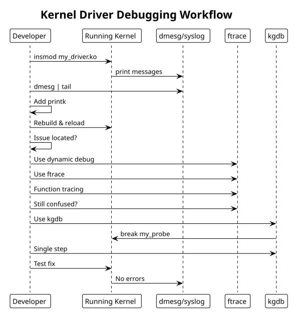

:PROPERTIES:
:ID:       i1j2k3l4-m5n6-4789-99a1-b2c3d4e5f6a7
:END:
#+title: Debugging Techniques
#+author: Arun Jyothish K
#+filetags: :debugging:kernel:printk:trace:kgdb:

*Kernel debugging: printk, dynamic debug, trace events, kgdb, crash analysis.*

** printk: Kernel Logging

Basic logging with log levels:

#+begin_src c
#include <linux/kernel.h>

// Log levels (KERN_EMERG, KERN_ALERT, ..., KERN_DEBUG)
pr_err("Error: %d\n", errno);
pr_warn("Warning: out of memory\n");
pr_info("Device registered at 0x%lx\n", addr);
pr_debug("Entering function\n");

// Device-specific logging (includes device name)
dev_err(&pdev->dev, "probe failed: %d\n", ret);
dev_info(&pdev->dev, "device initialized\n");

// Read kernel log
dmesg
dmesg | tail
tail -f /var/log/kern.log
#+end_src

** Dynamic Debug

Enable per-module debugging at runtime (compile-time overhead minimal):

#+begin_src bash
# Enable all debug messages in a module
echo "module my_driver +p" > /proc/dynamic_debug/control

# Enable by function
echo "func my_probe +p" > /proc/dynamic_debug/control

# Enable by file
echo "file drivers/my_driver.c +p" > /proc/dynamic_debug/control

# List current settings
cat /proc/dynamic_debug/control | grep my_driver
#+end_src

Code usage:

#+begin_src c
#define pr_fmt(fmt) "%s: " fmt, __func__

pr_debug("value: %d\n", val);  // enabled via dynamic_debug control
#+end_src

** Trace Events (kernel tracing)

Higher-level tracing via ftrace/trace-cmd:

#+begin_src c
#include <trace/events/custom.h>

// Define custom trace event (in header file)
// Then use:
trace_custom_event(value, status);
#+end_str>

Usage:

#+begin_src bash
# Enable tracing
echo 1 > /sys/kernel/debug/tracing/tracing_on

# Trace specific events
echo "my_driver:*" > /sys/kernel/debug/tracing/set_event

# Check trace output
cat /sys/kernel/debug/tracing/trace

# Real-time view
tail -f /sys/kernel/debug/tracing/trace_pipe

# Disable tracing
echo 0 > /sys/kernel/debug/tracing/tracing_on

# Use trace-cmd tool
trace-cmd record -e my_driver:*
trace-cmd report
#+end_src

** Kernel Debugger (kgdb)

Remote debugging via serial/network:

Configuration (requires specific kernel config):
- =CONFIG_KGDB=y=
- =CONFIG_KGDB_SERIAL_CONSOLE=y= (serial)
- Serial console configured

Start debugging:

#+begin_src bash
# On target (kernel with kgdb support)
# If using serial: append to boot cmdline: kgdboc=ttyS0,115200

# On host:
gdb vmlinux
(gdb) set arch <target-arch>
(gdb) target remote /dev/ttyUSB0  # or network port

# Useful commands
(gdb) break my_probe
(gdb) continue
(gdb) bt         # backtrace
(gdb) list       # source code
(gdb) step/next  # step/next line
(gdb) print var  # print variable
#+end_str>

** pr_devel and Compile-Time Debug

Conditional compilation:

#+begin_src c
#ifdef DEBUG
#define pr_debug_devel(fmt, ...) pr_info(fmt, ##__VA_ARGS__)
#else
#define pr_debug_devel(fmt, ...) do { } while (0)
#endif

pr_debug_devel("detailed info only in debug builds\n");

// Compile with: make CONFIG_DEBUG=1
#+end_src

** Module Parameter Debugging

Allow runtime parameter changes:

#+begin_src c
static int debug_level = 0;
module_param(debug_level, int, 0644);
MODULE_PARM_DESC(debug_level, "Debug verbosity level (0-3)");

static void log_debug(int level, const char *fmt, ...)
{
    va_list args;
    if (level <= debug_level) {
        va_start(args, fmt);
        vprintk(fmt, args);
        va_end(args);
    }
}

// Usage: insmod my_driver.ko debug_level=2
#+end_src

** Hardware Inspection

Read/write memory-mapped registers for debugging:

#+begin_src bash
# Display memory content as hex dump
hexdump /dev/mem -s 0x1000 -n 256

# Using devmem tool
devmem 0x1000 32          # read 32-bit value at 0x1000
devmem 0x1000 32 0xff    # write 0xff to 0x1000

# Using /proc/iomem
cat /proc/iomem | grep my_device

# Module info
cat /proc/modules        # loaded modules
cat /sys/module/my_driver/  # module sysfs interface
#+end_src

** Crash Dump Analysis

When kernel crashes, capture dmesg and use crash utility:

#+begin_src bash
# Boot kernel with: crashkernel=256M
# Trigger crash
echo c > /proc/sysrq-trigger

# Analyze dump
crash vmlinux /var/crash/vmcore
(crash) bt                  # backtrace
(crash) dis -l <function>   # disassemble with source
(crash) mod -v              # module details
#+end_str>

** Common Debugging Workflow

1. **Probe issues**: Add =pr_info()= at key points in probe/remove
2. **IRQ issues**: Check =grep my_driver /proc/interrupts=, verify =devm_request_irq()= call
3. **Memory leaks**: Use =kmemleak=: =echo scan > /sys/kernel/debug/kmemleak=
4. **Lock issues**: Enable =CONFIG_DEBUG_SPINLOCK=, check for deadlocks via =dmesg=
5. **Power/suspend**: Check device tree binding for =pm-runtime= properties
6. **Performance**: Use ftrace or perf to profile hot paths

** Example: Debug-enabled driver

#+begin_src c
#define pr_fmt(fmt) KBUILD_MODNAME ": " fmt

#ifdef DEBUG
#define DBG(fmt, ...) pr_debug(fmt, ##__VA_ARGS__)
#else
#define DBG(fmt, ...) no_printk(fmt, ##__VA_ARGS__)
#endif

static int my_probe(struct platform_device *pdev)
{
    struct device *dev = &pdev->dev;
    struct my_dev *mydev;

    DBG("probe called\n");

    mydev = devm_kzalloc(dev, sizeof(*mydev), GFP_KERNEL);
    if (!mydev) {
        dev_err(dev, "allocation failed\n");
        return -ENOMEM;
    }

    DBG("memory allocated at %p\n", mydev);

    // ... rest of probe

    dev_info(dev, "device registered\n");
    return 0;
}

// Compile debug version: make DEBUG=1
// Load with: insmod my_driver.ko (debug messages suppressed by default)
// Enable: echo "module my_driver +p" > /proc/dynamic_debug/control
#+end_src

** Debugging Workflow Diagram

#+begin_src plantuml :file res/10-debugging-workflow.svg
!theme plain
title Kernel Driver Debugging Workflow

participant Developer
participant Kernel as "Running Kernel"
participant Log as "dmesg/syslog"
participant Tracer as "ftrace"
participant Debugger as "kgdb"

Developer -> Kernel: insmod my_driver.ko
Kernel -> Log: print messages
Developer -> Log: dmesg | tail

Developer -> Developer: Add printk
Developer -> Kernel: Rebuild & reload

Developer -> Developer: Issue located?
Developer -> Tracer: Use dynamic debug
Developer -> Tracer: Use ftrace
Developer -> Tracer: Function tracing

Developer -> Tracer: Still confused?
Developer -> Debugger: Use kgdb
Debugger -> Kernel: break my_probe
Developer -> Debugger: Single step

Developer -> Kernel: Test fix
Kernel -> Log: No errors
#+end_src

** See Also
- [[id:j1k2l3m4-n5o6-4789-99a1-b2c3d4e5f6a7][Performance Considerations]]
- [[id:f1a2b3c4-d5e6-47f8-99a1-b2c3d4e5f6a7][Kernel Module Fundamentals]]
- [[id:bee17a98-9ba2-49bb-8169-6f1ff0f0132b][Interrupt Handling]] — =/proc/interrupts=, affinity, "irq nobody cared"
- [[id:k1l2m3n4-o5p6-4789-99a1-b2c3d4e5f6a7][Linux Boot Sequence]] — debugging boot issues with kgdb
