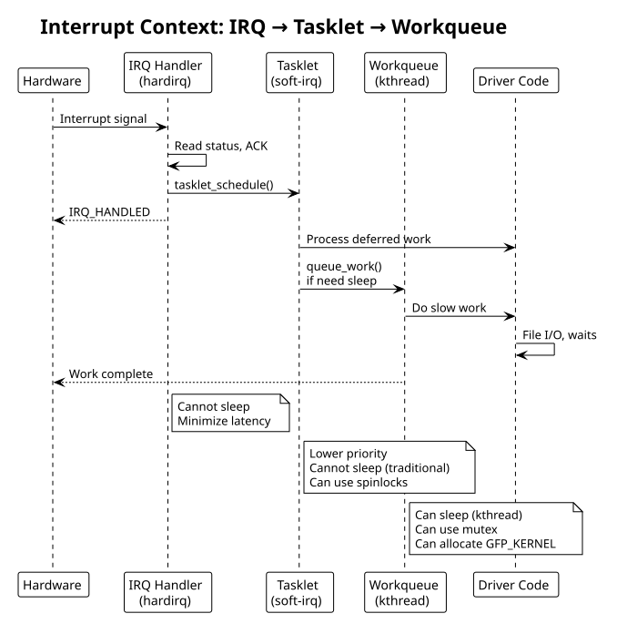

:PROPERTIES:
:ID:       j1k2l3m4-n5o6-4789-99a1-b2c3d4e5f6a7
:END:
#+title: Performance Considerations
#+author: Arun Jyothish K
#+filetags: :performance:optimization:locking:memory:rcu:

*Driver performance: memory layout, synchronization (spinlocks, tasklets, workqueues), RCU, lockless patterns.*

** Memory Efficiency

=__init= and =__exit= sections are freed after use:

#+begin_src c
// Freed after init (for built-in) / module load
static void __init setup_tables(void)
{
    // one-time initialization
}

// Freed after module unload (only applicable to modules)
static void __exit cleanup_tables(void)
{
    // cleanup
}

// Check memory savings
grep my_driver /proc/meminfo
#+end_str>

=devm_= allocators auto-free on error or device removal:

#+begin_src c
// Preferred: automatic cleanup on probe failure
void *buf = devm_kmalloc(&pdev->dev, size, GFP_KERNEL);

// Legacy: manual cleanup required
void *buf = kmalloc(size, GFP_KERNEL);
// ... must explicitly kfree(buf)
#+end_str>

** Synchronization: Spinlocks

Critical section protection (disables preemption, not suitable for long operations):

#+begin_src c
struct my_dev {
    spinlock_t lock;
    u32 register_cache;
};

// Static initialization
static DEFINE_SPINLOCK(global_lock);

// Or in structures
spin_lock_init(&dev->lock);

// Lock/unlock
unsigned long flags;
spin_lock_irqsave(&dev->lock, flags);
// critical section — cannot sleep
dev->register_cache = readl(dev->base + REG);
spin_unlock_irqrestore(&dev->lock, flags);

// Read/write spinlocks (multiple readers, single writer)
rwlock_t rw_lock;
read_lock(&rw_lock);
// ... multiple readers allowed
read_unlock(&rw_lock);

write_lock(&rw_lock);
// ... exclusive access
write_unlock(&rw_lock);
#+end_str>

** Tasklets: Deferred Soft IRQ

Schedule work at soft-IRQ priority (runs after hardirq handlers):

#+begin_src c
struct my_dev {
    struct tasklet_struct tasklet;
};

static void my_tasklet_handler(unsigned long arg)
{
    struct my_dev *dev = (struct my_dev *)arg;

    // Process deferred work (from interrupt handler)
    // CAN sleep in newer kernels with tasklet_setup(), but traditionally cannot
}

// Initialize
tasklet_init(&dev->tasklet, my_tasklet_handler, (unsigned long)dev);
// or newer:
tasklet_setup(&dev->tasklet, my_tasklet_handler);

// Schedule from IRQ handler
static irqreturn_t my_isr(int irq, void *dev_id)
{
    struct my_dev *dev = dev_id;

    // Handle immediate hardware interrupt
    u32 status = readl(dev->base + IRQ_STATUS);
    writel(status, dev->base + IRQ_STATUS);  // ack

    // Schedule deferred work
    tasklet_schedule(&dev->tasklet);

    return IRQ_HANDLED;
}

// Disable/enable at runtime
tasklet_disable(&dev->tasklet);
// ... driver shutdown
tasklet_enable(&dev->tasklet);

// Cleanup
tasklet_kill(&dev->tasklet);
#+end_str>

** Workqueues: Delayed Kernel Threads

For longer deferred work (can sleep, block):

#+begin_src c
struct my_dev {
    struct work_struct work;
    struct workqueue_struct *wq;
};

static void my_work_handler(struct work_struct *work)
{
    struct my_dev *dev = container_of(work, struct my_dev, work);

    // Can sleep, wait for locks, etc.
    msleep(100);

    // Access hardware
    writel(1, dev->base + COMMAND);
}

// Initialize
INIT_WORK(&dev->work, my_work_handler);
// or custom workqueue:
dev->wq = create_singlethread_workqueue("my_driver");
INIT_WORK(&dev->work, my_work_handler);

// Schedule from IRQ
static irqreturn_t my_isr(int irq, void *dev_id)
{
    struct my_dev *dev = dev_id;
    queue_work(dev->wq, &dev->work);
    return IRQ_HANDLED;
}

// Delayed work
static void schedule_delayed_work(struct my_dev *dev)
{
    INIT_DELAYED_WORK(&dev->dwork, my_work_handler);
    queue_delayed_work(dev->wq, &dev->dwork, msecs_to_jiffies(100));
}

// Cleanup
cancel_work_sync(&dev->work);
destroy_workqueue(dev->wq);
#+end_str>

** RCU (Read-Copy-Update)

Ultra-low-overhead read locks for read-heavy data:

#+begin_src c
struct my_data {
    struct rcu_head rcu;
    int value;
};

static struct my_data *global_data;

// Read-side (very fast, no locks)
rcu_read_lock();
struct my_data *data = rcu_dereference(global_data);
int val = data->value;
rcu_read_unlock();

// Write-side (publish new version)
struct my_data *new_data = kmalloc(sizeof(*new_data), GFP_KERNEL);
new_data->value = 42;
rcu_assign_pointer(global_data, new_data);

// Wait for all RCU readers to exit
synchronize_rcu();

// Free old version
kfree_rcu(old_data, rcu);  // auto-frees after RCU grace period
#+end_str>

**RCU is ideal for** config updates, routing tables, where reads vastly outnumber writes.

** Lockless Patterns

Atomic operations (no locks, hardware-supported):

#+begin_src c
atomic_t counter = ATOMIC_INIT(0);

atomic_inc(&counter);
atomic_dec(&counter);
int val = atomic_read(&counter);
atomic_set(&counter, 10);

// Atomic bitops
set_bit(0, &flags);
clear_bit(0, &flags);
test_bit(0, &flags);

// CAS (compare-and-swap)
atomic_cmpxchg(&val, old, new);
#+end_str>

** Per-CPU Data

Each CPU gets its own copy (no synchronization overhead):

#+begin_src c
static DEFINE_PER_CPU(struct stats, cpu_stats);

// On IRQ handler
this_cpu_inc(cpu_stats.packets);
this_cpu_add(cpu_stats.bytes, len);

// Read all CPUs
for_each_possible_cpu(cpu) {
    struct stats *s = per_cpu_ptr(&cpu_stats, cpu);
    total_packets += s->packets;
}
#+end_str>

** Memory Barriers

Ensure proper ordering of memory accesses:

#+begin_src c
// Write barrier (all previous writes complete before next write)
wmb();

// Read barrier
rmb();

// Full barrier (both read and write)
mb();

// Acquire/release semantics (preferred modern approach)
smp_store_release(&ptr, value);  // write with release semantics
value = smp_load_acquire(&ptr);  // read with acquire semantics
#+end_str>

** Example: Optimized device driver with deferred work

#+begin_src c
struct optimized_dev {
    struct device *dev;
    void __iomem *base;
    spinlock_t reg_lock;
    struct tasklet_struct rx_tasklet;
    struct workqueue_struct *work_queue;
    struct work_struct delayed_work;
    atomic_t packet_count;
};

// ISR: minimal work, schedule tasklet
static irqreturn_t my_isr(int irq, void *dev_id)
{
    struct optimized_dev *dev = dev_id;
    u32 status = readl(dev->base + STATUS);

    if (status & RX_READY) {
        writel(RX_ACK, dev->base + STATUS);
        tasklet_schedule(&dev->rx_tasklet);  // defer to soft-irq
    }

    return IRQ_HANDLED;
}

// Tasklet: process packets (soft-irq context)
static void rx_tasklet(unsigned long arg)
{
    struct optimized_dev *dev = (struct optimized_dev *)arg;

    while (readl(dev->base + RX_COUNT)) {
        // Fast packet processing
        u32 pkt = readl(dev->base + RX_DATA);
        atomic_inc(&dev->packet_count);
    }
}

// Workqueue: slow operations (can sleep)
static void delayed_handler(struct work_struct *work)
{
    struct optimized_dev *dev = container_of(work, struct optimized_dev, delayed_work);

    // Slow operations (e.g., file I/O, allocations)
    msleep(10);
    dev_info(dev->dev, "processed %d packets\n", atomic_read(&dev->packet_count));
}
#+end_str>

## Performance Profiling

#+begin_src bash
# IRQ latency
cat /proc/interrupts | grep my_driver

# Lock contention
grep spinlock_contention /proc/lock_stat

# Function tracing
echo "my_function" > /sys/kernel/debug/tracing/set_ftrace_filter
echo 1 > /sys/kernel/debug/tracing/tracing_on
# run workload
cat /sys/kernel/debug/tracing/trace

# Perf profiling
perf record -F 99 -g -- my_workload
perf report
#+end_str>

** Interrupt Context Hierarchy Diagram

#+begin_src plantuml :file res/08-interrupt-context.svg
!theme plain
title Interrupt Context: IRQ → Tasklet → Workqueue

participant Hardware
participant IRQ as "IRQ Handler\n(hardirq)"
participant Tasklet as "Tasklet\n(soft-irq)"
participant Workqueue as "Workqueue\n(kthread)"
participant Driver as "Driver Code"

Hardware -> IRQ: Interrupt signal
IRQ -> IRQ: Read status, ACK
IRQ -> Tasklet: tasklet_schedule()
IRQ --> Hardware: IRQ_HANDLED

Tasklet -> Driver: Process deferred work
Tasklet -> Workqueue: queue_work()\nif need sleep

Workqueue -> Driver: Do slow work
Driver -> Driver: File I/O, waits
Workqueue --> Hardware: Work complete

note right of IRQ
  Cannot sleep
  Minimize latency
end note

note right of Tasklet
  Lower priority
  Cannot sleep (traditional)
  Can use spinlocks
end note

note right of Workqueue
  Can sleep (kthread)
  Can use mutex
  Can allocate GFP_KERNEL
end note
#+end_src

** See Also
- [[id:i1j2k3l4-m5n6-4789-99a1-b2c3d4e5f6a7][Debugging Techniques]]
- [[id:f1a2b3c4-d5e6-47f8-99a1-b2c3d4e5f6a7][Kernel Module Fundamentals]]
- [[id:bee17a98-9ba2-49bb-8169-6f1ff0f0132b][Interrupt Handling]] — what belongs in the hard IRQ vs the deferred work covered here
