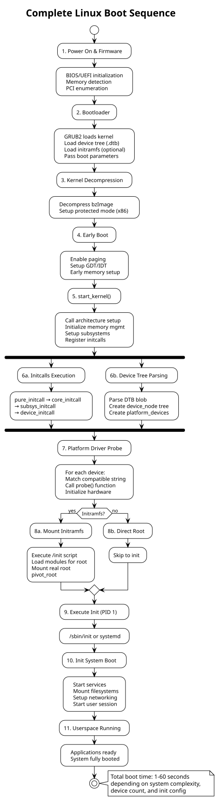

:PROPERTIES:
:ID:       k1l2m3n4-o5p6-4789-99a1-b2c3d4e5f6a7
:END:
#+title: Linux Boot Sequence
#+author: Arun Jyothish K
#+filetags: :linux:boot:bootloader:kernel:init:

*Complete Linux boot sequence from bootloader through userspace, covering all stages, initialization sequence, and driver loading.*

** Boot Sequence Overview

Linux boot is a multi-stage process that transitions from firmware → bootloader → kernel → init system → userspace applications.

Key stages:
1. **Firmware/BIOS** — Hardware initialization, bootloader selection
2. **Bootloader** — Load kernel image and device tree
3. **Kernel Decompression** — Extract and decompress vmlinuz
4. **Early Boot** — Setup arch-specific hardware, memory, interrupts
5. **Kernel Initialization** — Initialize subsystems (VFS, scheduler, etc.)
6. **Driver Probe** — Match and initialize hardware devices
7. **Initramfs** — Optional early userspace
8. **Init System** — Start PID 1 (systemd, OpenRC, etc.)
9. **Userspace** — System services and user applications

** Stage 1: Firmware & Bootloader

*** Power On & Firmware

Boot flow:
1. CPU executes reset vector (architecture-specific memory address)
2. **BIOS/UEFI** initializes:
   - CPU (enable caches, set MMU)
   - Chipset configuration
   - Memory detection
   - PCI device enumeration
   - Console (serial/video)
3. Firmware searches for bootable device (disk MBR, UEFI ESP, network)
4. Loads bootloader into memory

*** Bootloader Execution

Common bootloaders: GRUB2, U-Boot, LILO, Coreboot

GRUB2 boot sequence:

#+begin_src c
// Stage 1: MBR boot code (512 bytes)
// - Locate stage 1.5 or stage 2
// - Load via BIOS disk reads

// Stage 1.5: Load filesystem drivers
// - Read /boot/grub/ directory

// Stage 2: Full GRUB environment
// - Parse grub.cfg
// - Present menu (or auto-boot)
// - Load kernel: linux /vmlinuz root=/dev/sda1
// - Load initramfs: initrd /initrd.img
// - Load device tree (ARM): devicetree /dtb.dtb
// - Pass boot parameters to kernel
#+end_src

Boot parameters:
- `root=/dev/sda1` — root filesystem device
- `ro` — mount root read-only initially
- `console=ttyS0,115200` — console output
- `init=/bin/sh` — override init process
- `loglevel=7` — kernel log verbosity
- `quiet` — suppress boot messages

** Stage 2: Kernel Decompression & Early Boot

*** Kernel Image Format

Modern kernels are compressed (zImage or bzImage on x86):

#+begin_src
Linux kernel image layout:
┌─────────────────────────────┐
│ Boot sector (512 bytes)     │ ← Bootloader entry point
│ Kernel setup (> 4KB)        │ ← Parameter setup
│ Compressed kernel (vmlinuz) │ ← gzip/bzip2/xz compressed
│ Decompressor code           │ ← Minimal decompressor
└─────────────────────────────┘

Bootloader:
1. Loads boot sector
2. Calls entry point with parameters
3. Kernel decompressor runs (16-bit, real mode on x86)
4. Decompresses bzImage → uncompressed vmlinux
5. Jumps to kernel start_kernel()
#+end_src

*** Early Boot (Head Code)

Architecture-specific initialization (usually in assembly):

#+begin_src c
// arch/x86/kernel/head.S (simplified)

.globl startup_32
startup_32:
    // 1. Enable protected mode
    movl %eax, %cr0
    ljmp $__BOOT_CS, $1f    // Jump to 32-bit code

1:  // 2. Setup GDT (Global Descriptor Table)
    lgdt gdt_descr

    // 3. Setup IDT (Interrupt Descriptor Table - placeholder)
    // 4. Setup page tables (identity mapping early on)
    movl %cr3, %eax

    // 5. Enable paging
    movl %eax, %cr0
    movl %eax, %cr4

    // 6. Jump to kernel_start (C code)
    jmp kernel_start

    // All cpus reach this point eventually
#+end_src

** Stage 3: Kernel Initialization (start_kernel)

*** Main Kernel Entry

All architecture-specific code converges at =start_kernel()= (kernel/main.c):

#+begin_src c
// kernel/main.c
asmlinkage __visible void __init start_kernel(void)
{
    char *command_line;

    // 1. Setup CPU & memory subsystem
    setup_arch(&command_line);              // Arch-specific setup
    mm_init();                              // Memory management
    setup_interrupts();                     // IDT, IRQ routing

    // 2. Parse boot parameters
    parse_early_param();                    // Early cmdline parsing
    setup_log_buf();                        // Kernel log buffer

    // 3. Initialize core subsystems
    boot_cpu_init();                        // CPU (BSP bootstrap)
    page_address_init();                    // Page allocator
    setup_per_cpu_areas();                  // Per-CPU data

    // 4. Initialize memory zones
    mem_init();                             // High memory, page cache
    kmem_cache_init();                      // SLAB allocator

    // 5. Initialize core kernel systems
    setup_vfs();                            // VFS, root filesystem
    inode_init();                           // Inode cache
    dcache_init();                          // Directory cache

    // 6. Initialize tasking/scheduling
    fork_init();                            // Process creation
    sched_init();                           // Scheduler
    init_IRQ();                             // Interrupt handlers

    // 7. Initialize timekeeping
    time_init();                            // Clocks, timers
    tick_init();                            // Periodic tick

    // 8. Device & driver core
    driver_init();                          // Device model
    usb_init(), pci_init(), etc.            // Subsystem inits

    // 9. Mounted initial ramdisk or device tree
    // 10. Start init process
    kernel_init();                          // Calls init program
}
#+end_str>

*** Initcalls: Ordered Subsystem Initialization

Kernel uses =__initcall= macros to register initialization functions at different levels:

#+begin_src c
// Called in order during boot
pure_initcall(x)           // Level 0: Core
core_initcall(x)           // Level 1: Core subsystems
postcore_initcall(x)       // Level 2: Post-core
arch_initcall(x)           // Level 3: Architecture-specific
subsys_initcall(x)         // Level 4: Subsystems (buses, drivers)
fs_initcall(x)             // Level 5: Filesystems
device_initcall(x)         // Level 6: Devices (platform, pci, usb)
late_initcall(x)           // Level 7: Late (final setup)
module_init(x)             // Level 8: Loadable modules

// Example: PCI subsystem initialization
subsys_initcall(pci_driver_init);

// Example: Platform bus driver probe
device_initcall(platform_driver_register(&my_driver));
#+end_src

** Stage 4: Device Tree Parsing & Platform Device Discovery

*** Device Tree Parsing

Device tree blob (DTB) passed by bootloader:

#+begin_src c
// kernel/of/fdt.c
void __init unflatten_device_tree(void)
{
    // 1. Parse DTB passed by bootloader (in __dtb_start)
    // 2. Create in-memory device tree
    // 3. For each device node:

    // Create device_node structure
    struct device_node *node;
    node->full_name = "/soc/gpio@1000";
    node->properties = { "compatible", "vendor,gpio-controller", ... };

    // 4. Add to global device tree
    of_root = root_node;
}

// Later: arch-specific setup
void __init arch_of_populate_buses(void)
{
    // Create platform_device for each compatible node
    of_platform_populate(of_root, NULL, NULL, NULL);
}
#+end_src

Device tree nodes become platform devices:

#+begin_src dts
// Device tree source
soc {
  gpio@1000 {
    compatible = "vendor,gpio-controller";
    reg = <0x1000 0x100>;
  };

  led@2000 {
    compatible = "vendor,led-controller";
    reg = <0x2000 0x50>;
  };
};
#+end_src

Becomes (after parsing):

#+begin_src
platform_device("gpio.0")           // compatible="vendor,gpio-controller"
platform_device("led.0")            // compatible="vendor,led-controller"
#+end_str>

** Stage 5: Driver Probe & Hardware Initialization

*** Device Matching & Probe

Driver core matches devices with drivers:

#+begin_src c
// drivers/base/dd.c
int driver_probe_device(struct device_driver *drv, struct device *dev)
{
    // 1. Check if driver matches device
    if (!drv->bus->match(dev, drv)) {
        return -ENODEV;
    }

    // 2. Call driver probe
    ret = drv->probe(dev);          // my_gpio_probe()

    if (ret == 0) {
        // Probe succeeded
        dev->driver = drv;
        device_bind_driver(dev);
    }

    return ret;
}
#+end_src

Platform driver probe runs during device_initcall() level:

#+begin_src
[ 0.000000] Linux version 6.1.0 (build)
[ 0.000000] Command line: root=/dev/sda1 ro
[ 0.000000] KERNEL supported cpus:
[ 0.000000] x86/fpu: Supporting XSAVE feature 0x001: 'x87 floating point registers'
...
[ 0.345678] [Firmware Bug]: ACPI: DSDT has incorrect length (1234 vs 5678)
[ 1.234567] gpio-controller 1000.gpio: GPIO chip registered
[ 1.234890] led-controller 2000.led: LED device registered
[ 1.567890] EXT4-fs (sda1): mounted filesystem
[ 1.891234] VFS: Mounted root (ext4 filesystem)
#+end_src

** Stage 6: Initramfs (Optional Early Userspace)

*** Initramfs Purpose

Initramfs (initial RAM filesystem) provides early userspace utilities:
- Find and mount real root filesystem
- Setup LVM/RAID
- Load kernel modules needed for root
- Handle device discovery on live systems

*** Initramfs Boot Flow

#+begin_src bash
# After kernel initialization, if initramfs present:

# 1. Kernel mounts initramfs as root
mount /initramfs

# 2. Kernel executes /init script
exec /init

# Inside initramfs:
# /init script (often from dracut, mkinitcpio, etc.)
#!/bin/sh

# Load drivers needed for root filesystem
modprobe ata_piix           # IDE driver
modprobe ext4               # Filesystem

# Find root filesystem
ROOTDEV=$(blkid -U UUID-FROM-CMDLINE)

# Mount root filesystem
mount $ROOTDEV /real_root

# Transition from initramfs to real root
cd /real_root
pivot_root . old_root       # Chroot to new root
exec /sbin/init             # Start real init
#+end_bash

** Stage 7: Init System Startup

*** Transition to Init

Kernel calls init process (PID 1):

#+begin_src c
// kernel/init.c
static int kernel_init(void *unused)
{
    // ... kernel setup ...

    // Execute init program (from /proc/cmdline init= parameter)
    if (!execute_command) {
        // Default init programs (tried in order)
        if (try_to_run_init_process("/sbin/init"))
            try_to_run_init_process("/etc/init");
            try_to_run_init_process("/bin/init");
            try_to_run_init_process("/bin/sh");
    }

    panic("No init process");  // If all fail
}
#+end_src

Modern systems use **systemd** (PID 1):

#+begin_src
[ 2.123456] systemd[1]: systemd 247.0 running in system mode. (+PAM +AUDIT +SELINUX +IMA +APPARMOR +SMACK +SYSVINIT +UTMP +LIBCRYPTSETUP +GCRYPT +GNUTLS +ACL +XZ +LZ4 +ZSTD +SECCOMP +BLKID +ELFUTILS +KMOD +IDN2 -IDNA +PCRE2)
[ 2.234567] systemd[1]: Detected architecture x86-64.
[ 2.345678] systemd[1]: Started udev Kernel Device Manager.
[ 2.456789] systemd[1]: Started Load Kernel Modules.
[ 2.567890] systemd[1]: Started Network Manager.
[ 2.678901] systemd[1]: Reached target Multi-User System.
#+end_src

** Stage 8: Userspace Services & Desktop

Init system (systemd) starts services:

#+begin_src
systemd boot flow:
1. Read /etc/fstab → mount filesystems
2. Start services marked [Install] WantedBy=multi-user.target
3. Common services:
   - udev: device naming/hotplug
   - networking: ifup, dhcp
   - sshd: remote access
   - user session manager
   - X11/Wayland (if desktop)
4. Reaches target.wants (multi-user, graphical, etc.)
#+end_src

** Complete Boot Sequence Diagram

#+begin_src plantuml :file res/11-linux-boot-sequence.svg
@startuml linux_boot_sequence
!theme plain
title Complete Linux Boot Sequence

start
:1. Power On & Firmware;
:   BIOS/UEFI initialization
   Memory detection
   PCI enumeration;

:2. Bootloader;
:   GRUB2 loads kernel
   Load device tree (.dtb)
   Load initramfs (optional)
   Pass boot parameters;

:3. Kernel Decompression;
:   Decompress bzImage
   Setup protected mode (x86);

:4. Early Boot;
:   Enable paging
   Setup GDT/IDT
   Early memory setup;

:5. start_kernel();
:   Call architecture setup
   Initialize memory mgmt
   Setup subsystems
   Register initcalls;

fork
  :6a. Initcalls Execution;
  :pure_initcall → core_initcall
  → subsys_initcall
  → device_initcall;
fork again
  :6b. Device Tree Parsing;
  :Parse DTB blob
  Create device_node tree
  Create platform_devices;
end fork

:7. Platform Driver Probe;
:   For each device:
   Match compatible string
   Call probe() function
   Initialize hardware;

if (Initramfs?) then (yes)
  :8a. Mount Initramfs;
  :Execute /init script
  Load modules for root
  Mount real root
  pivot_root;
else (no)
  :8b. Direct Root;
  :Skip to init;
endif

:9. Execute Init (PID 1);
:   /sbin/init or systemd;

:10. Init System Boot;
:   Start services
   Mount filesystems
   Setup networking
   Start user session;

:11. Userspace Running;
:   Applications ready
   System fully booted;

stop

note right
  Total boot time: 1-60 seconds
  depending on system complexity,
  device count, and init config
end note
#+end_src

** Detailed Boot Stages

*** Stage 0: Power-On Self-Test (POST)

CPU starts at reset vector → firmware executes:
- Detect/test memory (memory size verification)
- Initialize chipset registers
- Enable/test caches
- Setup LAPIC (Local APIC) on x86
- Initialize console (serial/video output)

*** Stage 1: Bootloader (GRUB2)

#+begin_src
1. MBR Boot Code (512 bytes)
   - Minimal loader
   - Searches for Stage 2

2. Stage 1.5 (optional)
   - Filesystem-specific code
   - Loads from /boot/

3. Stage 2
   - Full GRUB environment
   - Parses grub.cfg
   - User menu or auto-boot
   - Loads kernel + initramfs + DTB
   - Sets up boot parameters
   - Jumps to kernel entry point
#+end_src

Boot parameters passed to kernel:

| Parameter | Purpose |
|-----------|---------|
| =root=/dev/sda1= | Root filesystem device |
| =ro= | Mount root read-only |
| =console=ttyS0,115200= | Serial console output |
| =quiet= | Suppress boot messages |
| =loglevel=7= | Kernel verbosity |
| =init=/bin/systemd= | Init program path |
| =vga=0x318= | Video mode (x86) |
| =noinitrd= | Skip initramfs |

*** Stage 2: Decompression & Real Mode → Protected Mode

#+begin_src c
// arch/x86/boot/compressed/head_64.S

startup_32:
    // 16-bit → 32-bit transition
    movl %ecx, %ebp         // Save boot_params
    jmp 1f
1:
    // Setup 32-bit protected mode
    lgdt gdt_descr          // Load GDT
    movl %cr0, %eax
    orl $1, %eax            // Set PE bit
    movl %eax, %cr0         // Enable protected mode
    ljmp $__BOOT_CS, $2f    // Far jump

2:
    // Now in 32-bit protected mode
    // Setup page tables
    // Setup paging (PAE)
    // Call decompressor: decompress_kernel()
    call decompress_kernel
    // Jump to uncompressed kernel
    ljmp $__KERNEL_CS, $0x100000
#+end_src

*** Stage 3: Kernel Memory Layout (x86_64)

After paging enabled:

#+begin_src
Virtual Address Space (64-bit):
┌─────────────────────────────────────────────┐
│ ffff800000000000 - ffffffffffffffff (128TB) │ Kernel space
│                                              │
│ ffffffff80000000 - ffffffff9fffffff         │ Identity mapping (kernel image)
│ ffffffff00000000 - ffffffff7fffffff         │ Modules
│ ffffc90000000000 - ffffc900ffffffff         │ Direct mapping (page cache)
│                                              │
└─────────────────────────────────────────────┘
│ 0000000000000000 - 00007fffffffffff (128TB) │ User space
│ (applications, libraries, heap, stack)      │
└─────────────────────────────────────────────┘
#+end_src

*** Stage 4-5: Subsystem Initialization Order

Kernel initializes subsystems in order via initcalls:

1. **pure_initcall** (early page zeroing, per-cpu areas)
2. **core_initcall** (memory allocators: SLAB, page allocator)
3. **postcore_initcall** (no_printk, tracers)
4. **arch_initcall** (x86: ACPI, APIC setup)
5. **subsys_initcall** (PCI, USB core, device model)
6. **fs_initcall** (filesystem registration: ext4, btrfs, NFS)
7. **device_initcall** (platform drivers, specific devices)
8. **late_initcall** (final setup: console switch, etc.)

*** Stage 6: Device Probe Sequence

For each hardware device (from device tree or ACPI/PCI):

#+begin_src
1. Device discovered (DTB, ACPI, PCI scan)
2. device_register(dev) called
3. Driver core searches registered drivers
4. compatible string match found
5. bus->probe(dev, driver) called
6. driver->probe(dev) executed
7. If successful:
   - Resources allocated (devm_*)
   - IRQs requested
   - Device initialized
   - sysfs entries created
   - Subsystem registration (GPIO, network, block, etc.)
8. If failed:
   - Resources freed (devm auto-cleanup)
   - Device remains unbound
   - May be probed later if driver loads
#+end_src

*** Stage 7: Initramfs Exit

On systems with initramfs:

#+begin_src bash
# Initramfs /init runs:
# 1. Load modules needed for root
# 2. Setup LVM/RAID if needed
# 3. Mount real root filesystem
# 4. Switch from initramfs to real root

# When ready, switch root:
pivot_root /new-root /old-root   # Make /new-root the new root
exec chroot . /sbin/init         # Execute real init
#+end_bash

*** Stage 8-9: Init System (systemd) Boot

#+begin_src
systemd boot sequence:

[*] Parse /etc/fstab
[*] Mount filesystems (marked "auto" or needed for boot)
[*] Start udev → /dev population, hotplug handling
[*] Start sysinit.target
[*] Execute OrderedAfter=sysinit dependencies
[*] Start basic.target
[*] Start multi-user.target
[*] Start services:
    - network.target (networking)
    - getty@tty1.service (login)
    - sshd.service (remote access)
    - user-session target (user services)

[OK] Reached multi-user.target

[*] If graphical.target:
    - Start display-manager (X11/Wayland)
    - Start user desktop session
#+end_src

** Boot Parameters (Kernel Cmdline)

Common boot parameters:

#+begin_src
# Storage
root=/dev/sda1                  # Root device
rootflags=ro,relatime           # Mount flags
rootfstype=ext4                 # Filesystem type

# Console & Logging
console=ttyS0,115200            # Serial console
console=tty0                    # Video console
loglevel=7                      # Kernel log level (0-8)
quiet                           # Suppress messages
debug                           # Verbose logging

# Boot Behavior
init=/sbin/systemd              # Init program
ro                              # Mount root read-only initially
rw                              # Mount root read-write

# Device/Driver
nvidia.modeset=1                # GPU driver
acpi=off                        # Disable ACPI
noapic                          # Disable APIC
nosmp                           # Disable SMP (multiprocessor)
nokaslr                         # Disable address space randomization

# Debugging
kgdb=ttyS0,115200               # Enable kgdb
kgdboc=ttyS0,115200             # kgdb console
crash_kexec=1                   # Enable kexec for kdump

# Modules
modprobe.blacklist=nouveau      # Blacklist module
#+end_src

View/modify boot parameters:

#+begin_src bash
# View current boot parameters
cat /proc/cmdline

# View kernel boot log
dmesg | head -100

# View systemd boot times
systemd-analyze
systemd-analyze blame           # Services taking time
#+end_src

** Performance Tuning

Boot optimization techniques:

| Technique | Benefit | Trade-off |
|-----------|---------|-----------|
| =quiet= parameter | Hide messages | Harder to debug |
| Initramfs optimization | Reduce init size | May need more modules |
| Parallel init (systemd) | Parallel service start | Complex dependencies |
| Module pre-loading | Faster device probe | Wasted memory if unused |
| Disable unused subsystems | Smaller kernel | Lost functionality |
| eBPF early load | Kernel code as modules | Debugging complexity |

Measure boot time:

#+begin_src bash
# Total boot time
systemd-analyze

# Per-service boot time
systemd-analyze blame

# Boot graph
systemd-analyze plot > boot-sequence.svg

# Kernel + userspace breakdown
systemd-analyze time

# Monitor during boot
systemd-analyze log-level debug
#+end_src

** See Also

- [[id:f1a2b3c4-d5e6-47f8-99a1-b2c3d4e5f6a7][Kernel Module Fundamentals]] — module lifecycle during/after boot
- [[id:a1b2c3d4-e5f6-4789-99a1-b2c3d4e5f6a7][Device Tree (DTS) & Bindings]] — device discovery during boot
- [[id:g1h2i3j4-k5l6-4789-99a1-b2c3d4e5f6a7][Platform Drivers]] — platform driver probe during boot
- [[id:i1j2k3l4-m5n6-4789-99a1-b2c3d4e5f6a7][Debugging Techniques]] — debugging boot issues with kgdb
